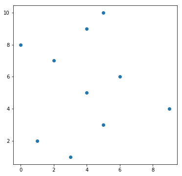
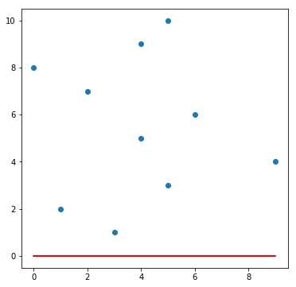
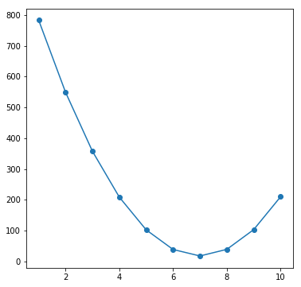
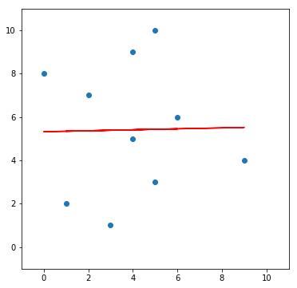
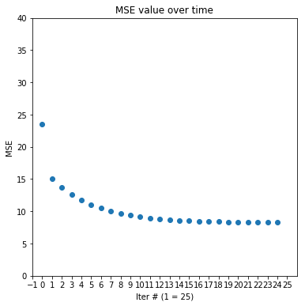
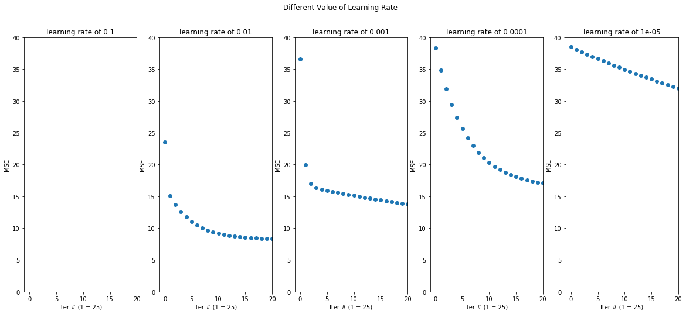

# Intro

In this post, I will talk about basics of gradient descent and its techniques.

So what is gradient descent?<br>
In simple words, it can be thought as steps to take to get the least possible error value computed from loss functions. This is like when we are on a mountain and try to get back to the ground, we check which directions are there to choose as we walk down. There could be only one path from the peak to the ground or several. One path could lead us to the bottom quickly while others may slow us down. We could think of this as gradient 'descent' since we are trying to get to the lowest point from where we are.

# Concepts

## Load Libraries


```python
import numpy as np
import pandas as pd
import matplotlib.pyplot as plt
```

Let's randomly generate x values and set y values in range (1, 10)<br>
As you may follow this, the graph will look different since it is random number.


```python
x = np.random.randint(10, size=10)
y = np.arange(1, 11)
```


```python
plt.figure(figsize=(6,6))
plt.scatter(x, y)
```


    <matplotlib.collections.PathCollection at 0x2677cfc8198>





In common practice, we set the bias and the slope for a line to start with 0 values that if we also put it on the graph, it looks like the following graph.


```python
plt.figure(figsize=(6,6))
plt.scatter(x, y)
m, b = np.zeros(1), np.zeros(1)
plt.plot(x, x*m+b, color='r')
plt.show()
```





For now, our predicted value for each $y_i$ is all 0. We will use MSE function from sklearn. With this, next step is to find the error value.


```python
from sklearn.metrics import mean_squared_error
```


```python
print('MSE : {}'.format(np.round(mean_squared_error(y, x*m + b)), 3))
```

    MSE : 38.0
    

Let's try assigning different values for m(slope) and look at a graph of error values.


```python
def diff_weight():
    mse = []
    for m in range(-5, 5):
        mse.append(np.round(mean_squared_error(y, x*m), 3))
    
    plt.figure(figsize=(6,6))
    plt.scatter(np.arange(1,11), mse)
    plt.plot(np.arange(1,11), mse)
    return np.array(mse)
    
```


```python
mse = diff_weight()
```





As we can see here the error starts from a high value and moves to the right, decreasing in its MSE. However, once it reaches a certain point, it began to increase. We call this minimum point as global minimum. Our goal is to find this global minimum point so that our MSE value is as low as possible. As mentioned in the beginning of the post, findind this point from the starting point is gradient descent since we are climbing down the error curve. 

We can see it from just looking at the graph but without it, it is hard to tell which direction we should move when we climb down since the starting point can be either on the left or the right side of the minimum. To get the idea of which direction, we use derivative of the error function.$$mse = \frac{1}{N}\sum_{i=1}^N(y_i - (mx_i + b))^2$$
$$m = \frac{-2}{N}\sum_{i=1}^N(y_i - (mx_i + b))x$$
$$b = \frac{-2}{N}\sum_{i=1}^N(y_i - (mx_i + b))$$

The first is the formula for the error function and the next two are its derivative value respect to m and b.<br>
With these formula, we can get the slope of the function that we can decide in which direction to go. The code is as follows.

By setting some arbitrary value for learning rate, we can now update our next point to move on as the next statement. $$x = x - slope * a$$
Since we are moving little by little to avoid getting away from the global minimum, we should iterate until we reach the point. The code is as follows.


```python
def grad_m(m, x, y, b):
    return -2 * np.mean(x * (y - (x * m + b)))

def grad_b(m, x, y, b):
    return -2 * np.mean(y - (x * m + b))
```

We can now implement our gradient descent function to get appropriate m and b.


```python
def gradient_descent(x, y):
    m, b = 0, 0
    
    while True:
        
        m -= grad_m(m, x, y, b)
        b -= grad_b(m, x, y, b)
        
        if m == 0 or b == 0:
            return m, b
```

But this implementation has its problems. <br>
First, we are updating the values by substracting the previous value by the new value.<br>
Second, we are iterating until either m or b reaches 0 which means we are looping until one of them reaches a point where its slope value is 0.

Let's look at a graph of simple quadratic function($y=x^2$) below. Let's assume that we are at (-2, 4) (red dot) and its slope is -4. The above code updates our new m (or b) in a way that it just moves the current point by the value of the slope. <br>
Our current m is -2 and the slope is -4. If we do m = -2 - (-4), we would get new m value of 2 which is just the opposite side of the graph, only changed in its direction while having slope. Because of this reason, at each iteration, we should carefully choose how much step we would like to move to the desired direction. For this, we need a variable named 'learning_rate' or $\alpha$.<br>
In an analogy from above again that from the top of a mountain, we don't want to rush down to a path when we are not sure if that direction is a correct way to go even if it 'looks' it goes down.

This learning rate can be any value but usually much less than 1(which is the case above).

But by using learning rate, this raises a problem if while loop is used. We don't know how many iterations it would take to reach the minimum point. As our data becomes large and more variables are introduced, we cannot guarantee how many iteration it would take that we don't know when we could get it. This is why we preset the number of iteration when doing gradient descent. Its value can any number of positive integer. 

With this change, we can update our function.


```python
def gradient_descent(x, y, learning_rate=0.01, num_iter=500):
    m, b = 0, 0
    
    for _ in range(num_iter):
        
        dm = grad_m(m, x, y, b)
        db = grad_b(m, x, y, b)
        
        m -= dm * learning_rate
        b -= db * learning_rate
        
    return m,b
```

Simple as above!<br>
dm and db means the change in m and b (d means delta $\Delta$ or 'change in'). 

I'm going to add some other statements to get mse values at certain number of iterations.


```python
def gradient_descent(x, y, learning_rate=0.01, iter_num=500):
    
    m = 0
    b = 0
    
    mse = np.array([])
    
    for i in range(iter_num):
        
        db = grad_b(m, x, y, b)
        dm = grad_m(m, x, y, b)
        
        b -= db * learning_rate
        m -= dm * learning_rate

        if i % 20 == 0:
            error = mean_squared_error(y, x*m + b)
            mse = np.append(mse, [error])
    
    return np.round(m,3), np.round(b,3), mse
```

Using the same x, y defined and new gradient function, we can now get new m and b values and see in in a graph.


```python
m, b, mse = gradient_descent(x, y)
```


```python
plt.figure(figsize=(6,6))
plt.xlim(-1, 11)
plt.ylim(-1, 11)
plt.scatter(x, y)
plt.plot(x, (m*x+b), c='r')
plt.show()
```





The line seems about right!<br>
By the mse values returned by the function, we can also check out how error values change over each iteration.


```python
plt.figure(figsize=(6,6))
plt.scatter(np.arange(0,len(mse)), mse)
plt.ylabel('MSE')
plt.xlabel('Iter # (1 = 25)')
plt.xlim(0,len(mse)+1)
plt.ylim(0, 40)
plt.xticks(np.arange(-1, len(mse)+1))
plt.title('MSE value over time')
plt.show()
```





As you can see, MSE decreases over each iteration and stop going down once it hits the minimum point. <br>
What we'll do next is how much can different values of learning rate can affect MSE.


```python
plt.figure(figsize=(20,8))

learning_rate = [0.1, 0.01, 0.001, 0.0001, 0.00001]

for i in range(len(learning_rate)):
    plt.subplot(1, len(learning_rate), i+1)
    plt.title('learning rate of {}'.format(learning_rate[i]))
    plt.suptitle('Different Value of Learning Rate')
    
    m, b, mse = gradient_descent(x, y, learning_rate=learning_rate[i])
    plt.scatter(np.arange(0,len(mse)), mse)
    plt.ylabel('MSE')
    plt.xlabel('Iter # (1 = 25)')
    plt.xlim(-1,20)
    plt.ylim(0, 40)

```

    c:\users\hsong1101\anaconda3\envs\tensorflow\lib\site-packages\sklearn\metrics\regression.py:239: RuntimeWarning: overflow encountered in square
      output_errors = np.average((y_true - y_pred) ** 2, axis=0,
    





As you can see, when the learning rate is 0.1, there are no dots in the graph because it is too high that at each iteration, it just gets further from the minimum point. But from 0.01, we can actually see the values get decreasing. <br>
As the learning rate gets smaller, the curve becomes more straight that reaching the minimum point becomes slower too and hence, takes more iterations and time. This is why it is important to set an appropriate value for learning rate and number of iterations. This is one of feature-engineering. In this example, we tried putting different values for the rate to find a proper one and this technique is called Grid Search (which to be discussed later).
