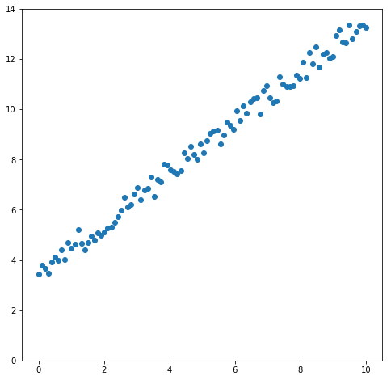
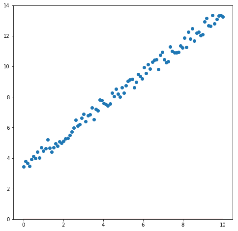
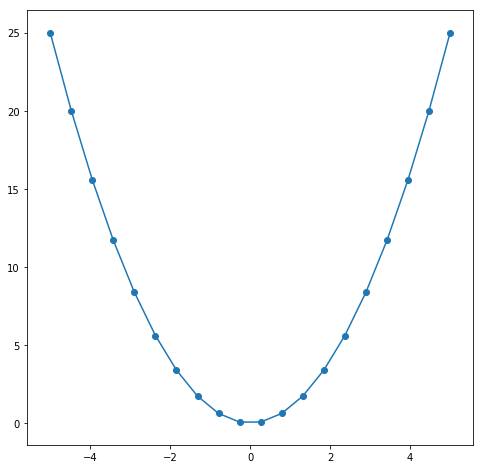
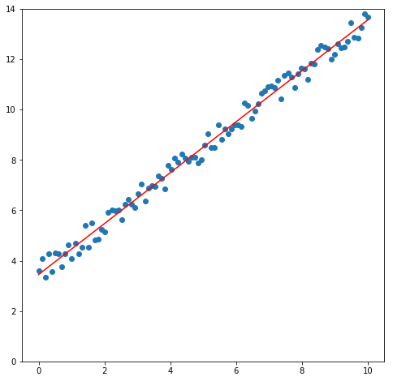
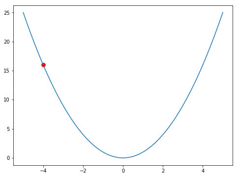
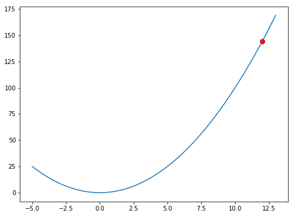
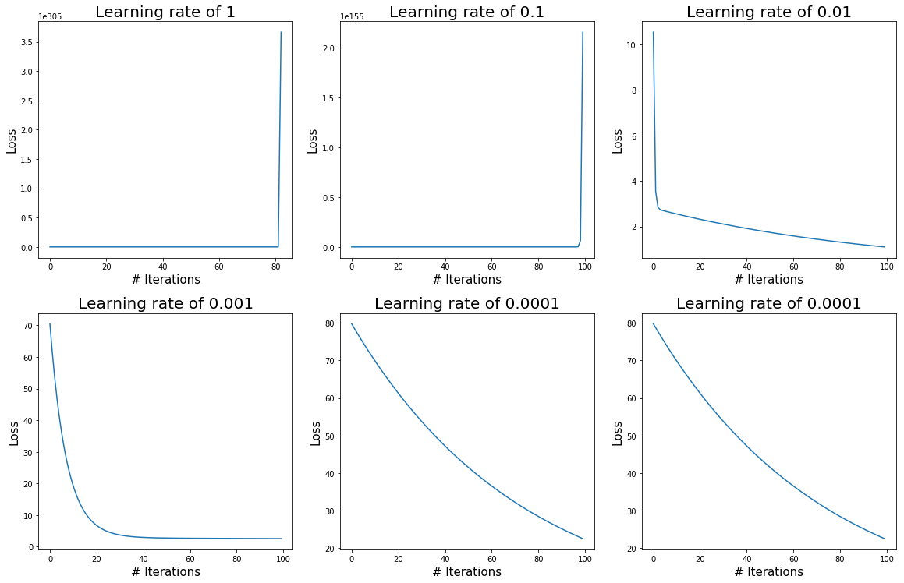

# What is Gradient Descent?

Gradient descent is one of basic but very important machine learning techniques to find the best optimum values, among possible ones, of weights such that it minimizes total loss values.

When we define a model such as SVM, Linear Regression or Decision Tree Classifier, we have to have some sort of a way to know if our model is being trained well or not. And to know that, we use loss function which computes the difference between true values, usually noted as $y$ value, and predicted values, $\hat y$.

One simple loss function can be MSE whose equation is
$$L = \frac{1}{N}\sum_{i=1}^N(y_i - \hat y_i)^2 = \frac{1}{N}\sum_{i=1}^N(y_i - (x_iw + b))^2$$ 

When we first initialize a model, usually its weights are generated randomly and every time we train, we update them in a way that in the next training step, it lowers the loss value.

This process until it no more lowers the loss is called gradient descent.

# Codes & Explanation


```python
import numpy as np
import pandas as pd
import matplotlib.pyplot as plt
```

Let's randomly generate x values and set y values in range (1, 10)<br>
As you may follow this, generated data will look different since it is random.


```python
x = np.linspace(0, 10, 100)
y = np.random.random(100) + x + 3
```



If we try to find a line that has the lowest loss values (or fits the data), it would be something like this.


The red line was not the best line as it was manually done.

So to find the best line, let's start from 0 for both weights and bias (But in practice, weights are also initialized randomly).


```python
w = b = 0
```

This weight and bias will look like this.



And let's use the same loss function mentioned above.

To compute the gradient descent, we need partial derivatives with respect to weights and bias (if there is). The followings are corresponding equations.

$$MSE = \frac{1}{N}\sum_{i=1}^N(y_i - (x_iw + b))^2$$ 
$$\frac{\partial MSE}{\partial w} = \frac{-2}{N}\sum_{i=1}^N(y_i - (x_iw + b))x_i$$
$$\frac{\partial MSE}{\partial b} = \frac{-2}{N}\sum_{i=1}^N(y_i - (x_iw + b))$$

## Convex problem (brief overview)

Before proceeding further, let me go how we get to obtain an optimal weights (and bias).

In a perfect world where there always exists only one optimum, our loss values might look like this.

 

We can see that at first, the loss is big and as it progresses, it moves toward 0 but after that it increases back. Cases such as above where there only exists one curve is called convex problem and in such cases, we are guaranteed to reach the optimal value.

It does not matter if the loss can actually get to 0 or not because even then, it achieves best possible minimum. 

So how do we get there? If you have taken calculus, you know that at each point of a line there exists a tangent line (or multiple in some cases). With those tangent lines and its derivatives, we gain information on which direction we should go to reach the lowest point.

Whether the problem is convex or not, we can always reach an optimum (it could be global or local, depending on convexity of problems). Those optimal points have the derivative of 0 (horizontal line at a point).

With the above graph, we see that at point of 0 we have the horizontal line and that's where we would like to be.

So when problems are not convex, meaning there exists many points with derivative of 0's, we are not guaranteed to reach the global optimum but most likely a local one. These cases will be covered in another post.

## Gradient Descent Implementation

The code for the partial derivatives and MSE are defined next.


```python
# Loss function
def mse(y, x, w, b):
    
    return np.mean((y - (x * w + b))**2)

# Partial Derivative with respect to w
def partial_w(y, x, w, b):
    
    return -2 * np.mean((y - (x * w + b)) * x)

# Partial Derivative with respect to b
def partial_b(y, x, w, b):
    
    return -2 * np.mean(y - (x * w + b))
```

Since we are using MSE which is a convex function, we know we can get to the global optimum following code.


```python
w = b = 0

learning_rate = 1e-2

loss = []

for i in range(1000):

    dw = partial_w(y, x, w, b)
    db = partial_b(y, x, w, b)

    w = w - dw * learning_rate
    b = b - db * learning_rate
    
    if i % 20 == 0:
        
        l = mse(y, x, w, b)
        
        print('Loss :', l)
        
        loss.append(l)
```

    Loss : 10.555032679051148
    Loss : 2.310796035090503
    Loss : 1.9087972406483862
    Loss : 1.5793568720457842
    Loss : 1.3093785587634366
    Loss : 1.0881297483885783
    Loss : 0.9068150513036444
    Loss : 0.7582265941575854
    Loss : 0.6364574824859369
    Loss : 0.5366669816482634
    Loss : 0.4548880812298567
    Loss : 0.3878697929408484
    Loss : 0.3329479128200721
    Loss : 0.28793911010352097
    Loss : 0.2510541324311872
    Loss : 0.22082667700526815
    Loss : 0.19605510008734917
    Loss : 0.17575464758964404
    Loss : 0.1591183077644841
    Loss : 0.14548472975387144
    Loss : 0.13431193265277144
    Loss : 0.1251557599323617
    Loss : 0.11765222271358215
    Loss : 0.11150302997630385
    Loss : 0.10646373048091924
    Loss : 0.10233399500357193
    Loss : 0.09894965257096182
    Loss : 0.09617616410808294
    Loss : 0.09390327405428577
    Loss : 0.09204062733128923
    Loss : 0.0905141774227714
    Loss : 0.08926324277453858
    Loss : 0.08823809449720738
    Loss : 0.08739797947441223
    Loss : 0.086709500288393
    Loss : 0.08614528755951621
    Loss : 0.08568291192072999
    Loss : 0.08530399237425228
    Loss : 0.08499346558464933
    Loss : 0.08473898706023052
    Loss : 0.08453044041769076
    Loss : 0.084359535221608
    Loss : 0.0842194774115547
    Loss : 0.08410469921518313
    Loss : 0.08401063781041529
    Loss : 0.08393355393781071
    Loss : 0.08387038325233774
    Loss : 0.08381861450527982
    Loss : 0.0837761897135923
    Loss : 0.0837414223481059


 


```python
w, b
```


    (1.0028761687323586, 3.49054178136775)


We can see that the best w is around 1.011 and b is 3.413.

## Experiments with Learning Rates

One very important thing in gradient descent is to choose an appropriate learning rate. Learning rate is how much we move towards the optimum value. Setting it too high will cause not being able to reach the optimal because it bounces off too much, while setting it too low will make it slow.

Let's look at an example of setting a high learning rate.



The above is the graph of $f(x) = x^2$ and our current w is -4. To get to the optimum, we have to move to the right by 4. With the derivative of the function and the learning rate of 2, we will have the new weight of 
$$w = w - lr * dw = -4 - 2 * (-8) = 12$$



We can see that the red dot is now much further away from the starting point!

Now we if use too low learning rate such as 0.00001, from w of -4 will be $$w = w - lr*dw = -4 - 0.00001*(-8) = -3.99992$$


It didn't progress much that it seems as though it did nothing at all.

For such, when we try to find the best weights we have to try many different learning rates and use the best one.

The following 6 graphs are plots of losses on diffrent learning rates on the same data we used above.



The first two learning rates are set too high that the final loss is too high. The next two losses seem fine but we can see that using the learning rate of 0.001 works better (converges faster) than 0.01. The last two seem to be working as well but it converges too slow that we don't want to use or train for a longer period.

# Conclusion

We've covered what gradient descent is and how setting a different value for learning rates affects the speed of convergence of it. Gradient descent is very important concept in all of machine learning, from supervised and unsupervised to deep learning, and without understanding how it works, a model made might not be able to work well.

Thank you again for reading the post and if you have seen any typos or mistakes or have any other suggestions, please let me know.

You can find the full code at [this link]()
