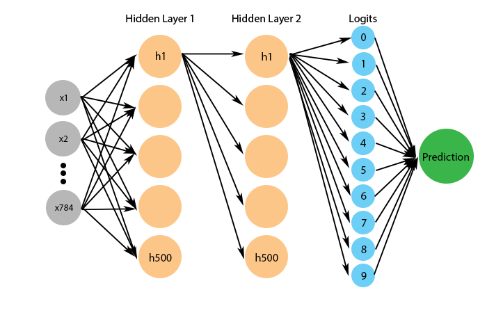
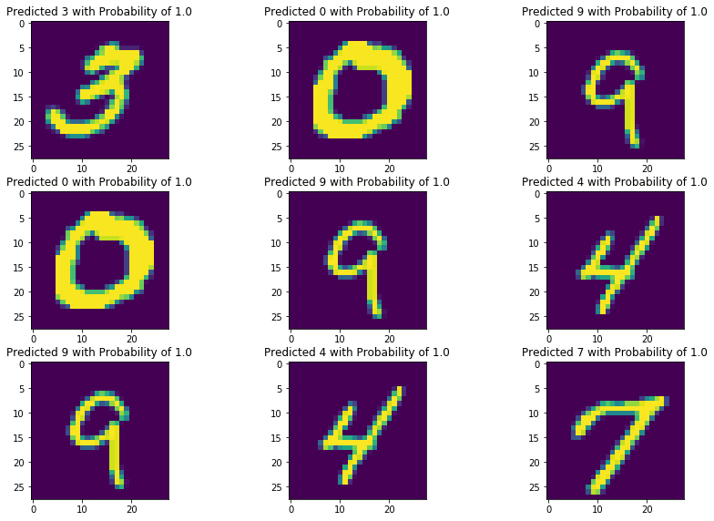

# Intro 

MNIST is a data set of hand-written digits from 0 to 9 and used as a guide or a tutorial for Convolutional Neural Network (CNN) as the size of it is not big that it's easy to train and test a model. In this post we will implement two different models using CNN and Fully Connected Layers.

Generally it is better to use CNN instead of FCL for a better performance and memory allocation but I will use these two to show how each of them works and compare their performance at the end.

The purpose of this post is to introduce you how to use simple tensorflow functions and build models with it. In-depth explanation about CNN will be covered in later posts.

Before starting, you can download the data from [here](https://www.kaggle.com/c/digit-recognizer/data). I am only using the train.csv file as there is no way for us to evaluate using test.csv. But if you have an account (or want to try) after this tutorial, you can predict values for test set and submit on Kaggle to see how well your model performs.

# Code


```python
import tensorflow as tf
import numpy as np
import pandas as pd

from sklearn.model_selection import train_test_split
```


```python
data = pd.read_csv('./train.csv')
```

If you load and check out the first image, you will see that very first column is the label and the rest are pixel columns that range from 0 to 255 (inclusive).


```python
data.head(1)
```


<div>
<style scoped>
    .dataframe tbody tr th:only-of-type {
        vertical-align: middle;
    }

    .dataframe tbody tr th {
        vertical-align: top;
    }

    .dataframe thead th {
        text-align: right;
    }
</style>
<table border="1" class="dataframe">
  <thead>
    <tr style="text-align: right;">
      <th></th>
      <th>label</th>
      <th>pixel0</th>
      <th>pixel1</th>
      <th>pixel2</th>
      <th>pixel3</th>
      <th>pixel4</th>
      <th>pixel5</th>
      <th>pixel6</th>
      <th>pixel7</th>
      <th>pixel8</th>
      <th>...</th>
      <th>pixel774</th>
      <th>pixel775</th>
      <th>pixel776</th>
      <th>pixel777</th>
      <th>pixel778</th>
      <th>pixel779</th>
      <th>pixel780</th>
      <th>pixel781</th>
      <th>pixel782</th>
      <th>pixel783</th>
    </tr>
  </thead>
  <tbody>
    <tr>
      <th>0</th>
      <td>1</td>
      <td>0</td>
      <td>0</td>
      <td>0</td>
      <td>0</td>
      <td>0</td>
      <td>0</td>
      <td>0</td>
      <td>0</td>
      <td>0</td>
      <td>...</td>
      <td>0</td>
      <td>0</td>
      <td>0</td>
      <td>0</td>
      <td>0</td>
      <td>0</td>
      <td>0</td>
      <td>0</td>
      <td>0</td>
      <td>0</td>
    </tr>
  </tbody>
</table>
<p>1 rows × 785 columns</p>
</div>


Before proceeding, we split the first column from the rest.


```python
y = np.asarray(data['label'], dtype=np.int32)
x = np.asarray(data.drop('label', axis=1), dtype=np.float32)
```


```python
x.shape, y.shape
```


    ((42000, 784), (42000,))


There are total of 42000 examples and 784 columns in each. 784 are the total number of pixels in each image (28 by 28). Pixels are aligned in one long array (784 length) instead of (28,28) and this is fine for fully connected layers but later when we use CNN, we have to convert it back to its original shape.

First let's split them into training and testing sets and implement a model using FCL.


```python
X_train, X_test, y_train, y_test = train_test_split(x, y)
```

Before proceeding, let me briefly explain the structure of a model. First it will take an input array of size (batch size, 784). Then it will be connected to the first hidden layer (fully-connected) of size (, 500) followed by a relu layer. After that I will add another set of hidden layer and relu with the same size. After that will be connected to another fully connected layer with the size of 10. This 10 units will be probability values of each example being classified as its index label. First index (0) will contain the probability of being digit 0, second index (1) being digit 1 and so on and output the label with the highest probability.

So each example will be transformed (1, 784) -> (1, 500) -> (1, 500) -> (1, 10) -> (1, 1).



Each unit in hidden layer is a perceptron covered in [here]().

Layers of hidden layer can be thought as a blackbox of an algorithm that computes the input values in some ways behind the scene and outputs a predicted value at the end. This layer consists of small units called 'perceptron' and the post about perceptron can be found [here](https://tlr.gitbook.io/data-science/neural-network/perceptron).

These two layers are called fully-connected because each units are connected to the next layers' units. Though in the picture some arrows are missing in hidden layers, each units are actually fully connected to the next layer.

Relu is a function that transforms the input it receives to achieve non-linearity (More will be covered in another post) and is called 'Activation function'.

Let's first define a function that builds the structure of a model.


```python
def model_fn(features, labels, mode):
    
    # mode tells if it is used for training, evaluating or predicting
    
    # Array of examples of pixels
    input_layer = features['x']
    
    hidden1 = tf.layers.dense(input_layer, units=500, activation=tf.nn.relu)
    
    hidden2 = tf.layers.dense(hidden1, units=500, activation=tf.nn.relu)
    
    # layer that holds 10 units for probabilities
    logits = tf.layers.dense(inputs=hidden2, units=10)
    
    pred = {
            'digit': tf.argmax(input=logits, axis=1),
            'prob': tf.nn.softmax(logits)
        }
    
    # if mode is predict, should return next
    if mode == tf.estimator.ModeKeys.PREDICT:
        
        return tf.estimator.EstimatorSpec(mode=mode, predictions=pred)

    # loss value needed to train a model and evaluate
    loss = tf.losses.sparse_softmax_cross_entropy(labels=labels, logits=logits, )
    
    # if mode is train
    if mode == tf.estimator.ModeKeys.TRAIN:
        
        optimizer = tf.train.GradientDescentOptimizer(learning_rate=0.001)
        train_optimizer = optimizer.minimize(loss=loss, global_step=tf.train.get_global_step())
        
        return tf.estimator.EstimatorSpec(mode=mode, loss=loss, train_op=train_optimizer)

    # if neither train or predict
    evaluation = {'accuracy': tf.metrics.accuracy(labels=labels, predictions=pred['digit'])}
    
    return tf.estimator.EstimatorSpec(mode=mode, loss=loss, eval_metric_ops=evaluation)
```

Logits is a vector of size 10 that holds the probabilities of ten labels and the maximum among them will be classified as the predicted label of each given image.


```python
# Create the Estimator
mnist_classifier = tf.estimator.Estimator(
  model_fn=model_fn, model_dir="./model/")

train_input_fn = tf.estimator.inputs.numpy_input_fn(
    x={"x": X_train},
    y=y_train,
    batch_size=100,
    num_epochs=None,
    shuffle=True)

# mnist_classifier.train(
#     input_fn=train_input_fn,
#     steps=5000)
```

    INFO:tensorflow:Using default config.
    INFO:tensorflow:Using config: {'_model_dir': './model/', '_tf_random_seed': None, '_save_summary_steps': 100, '_save_checkpoints_steps': None, '_save_checkpoints_secs': 600, '_session_config': None, '_keep_checkpoint_max': 5, '_keep_checkpoint_every_n_hours': 10000, '_log_step_count_steps': 100, '_train_distribute': None, '_device_fn': None, '_service': None, '_cluster_spec': <tensorflow.python.training.server_lib.ClusterSpec object at 0x000002478A045EF0>, '_task_type': 'worker', '_task_id': 0, '_global_id_in_cluster': 0, '_master': '', '_evaluation_master': '', '_is_chief': True, '_num_ps_replicas': 0, '_num_worker_replicas': 1}
    

model_dir in Estimator is a path to save a model we build. You can put it anywhere you want and I am creating a subdirectory named 'model' to store it. 

Once a model is declared and the first time it trains, it will create a checkpoint once in a while that we can load it later to avoid training it all over again. Below is our evaluation on the model and its accuracy and loss.


```python
# Evaluate the model and print results
eval_input_fn = tf.estimator.inputs.numpy_input_fn(
  x={"x": X_test}, y=y_test, num_epochs=1, shuffle=False)

fcm_eval = mnist_classifier.evaluate(input_fn=eval_input_fn)

print(fcm_eval)
```

    INFO:tensorflow:Calling model_fn.
    INFO:tensorflow:Done calling model_fn.
    INFO:tensorflow:Starting evaluation at 2018-12-27-03:51:52
    INFO:tensorflow:Graph was finalized.
    INFO:tensorflow:Restoring parameters from ./model/model.ckpt-5000
    INFO:tensorflow:Running local_init_op.
    INFO:tensorflow:Done running local_init_op.
    INFO:tensorflow:Finished evaluation at 2018-12-27-03:51:53
    INFO:tensorflow:Saving dict for global step 5000: accuracy = 0.98190475, global_step = 5000, loss = 0.17396037
    INFO:tensorflow:Saving 'checkpoint_path' summary for global step 5000: ./model/model.ckpt-5000
    {'accuracy': 0.98190475, 'loss': 0.17396037, 'global_step': 5000}
    

Now let's randomly draw 10 examples from testing data and compare the prediction with true labels.


```python
samples = np.random.randint(0, high=len(X_test), size=10)

X_samples = X_test[samples]
y_samples = y_test[samples]
```


```python
pred_fn = tf.estimator.inputs.numpy_input_fn(
  x={"x": X_samples}, num_epochs=1, shuffle=False)

prediction = list(mnist_classifier.predict(input_fn=pred_fn))
```

    INFO:tensorflow:Calling model_fn.
    INFO:tensorflow:Done calling model_fn.
    INFO:tensorflow:Graph was finalized.
    INFO:tensorflow:Restoring parameters from ./model/model.ckpt-5000
    INFO:tensorflow:Running local_init_op.
    INFO:tensorflow:Done running local_init_op.
    


```python
prediction
```


    [{'digit': 1,
      'prob': array([0.0000000e+00, 1.0000000e+00, 9.4095213e-15, 6.0534783e-29,
             3.5331415e-31, 1.1711298e-33, 2.0040707e-27, 8.5007272e-23,
             2.8463980e-31, 3.7244722e-32], dtype=float32)},
     {'digit': 0,
      'prob': array([1.0000000e+00, 3.8130331e-37, 6.2349730e-36, 0.0000000e+00,
             0.0000000e+00, 3.5814864e-26, 8.6111131e-37, 0.0000000e+00,
             0.0000000e+00, 2.3840322e-38], dtype=float32)},
     {'digit': 1,
      'prob': array([6.5226101e-30, 1.0000000e+00, 3.0400010e-16, 1.2914735e-21,
             3.2304384e-17, 7.0729110e-15, 3.8646916e-32, 1.3322372e-26,
             7.0250941e-17, 3.3421232e-18], dtype=float32)},
     {'digit': 0,
      'prob': array([1.0000000e+00, 0.0000000e+00, 0.0000000e+00, 3.0138492e-30,
             0.0000000e+00, 0.0000000e+00, 7.1665795e-16, 1.3138436e-15,
             7.9213934e-33, 1.2990128e-37], dtype=float32)},
     {'digit': 4,
      'prob': array([2.8911891e-23, 3.9594085e-15, 1.9615884e-13, 2.2591231e-20,
             9.9999976e-01, 8.8821073e-17, 2.1321697e-24, 1.2081528e-11,
             1.3982296e-11, 2.7312331e-07], dtype=float32)},
     {'digit': 0,
      'prob': array([1.0000000e+00, 1.4622906e-24, 5.3600551e-11, 2.8611191e-14,
             1.1262419e-20, 1.9843341e-08, 1.4896989e-09, 1.7410040e-31,
             1.4625584e-09, 1.8254336e-16], dtype=float32)},
     {'digit': 9,
      'prob': array([3.27441773e-22, 9.91370282e-27, 2.43543868e-15, 3.57504418e-14,
             2.09054610e-06, 2.92580794e-25, 1.82457674e-20, 1.23018045e-11,
             1.89159088e-08, 9.99997854e-01], dtype=float32)},
     {'digit': 1,
      'prob': array([1.8931302e-33, 1.0000000e+00, 4.3494351e-17, 5.9798925e-15,
             1.6412016e-14, 5.5567313e-18, 1.1128256e-24, 8.0763518e-10,
             2.3412819e-11, 1.1636596e-14], dtype=float32)},
     {'digit': 9,
      'prob': array([2.1326464e-19, 8.1656124e-14, 3.8080655e-19, 6.2019244e-14,
             1.1153921e-05, 8.4537146e-13, 3.8319808e-18, 8.0243541e-07,
             9.3108823e-18, 9.9998808e-01], dtype=float32)},
     {'digit': 7,
      'prob': array([8.6858084e-21, 5.4370521e-23, 2.5062871e-26, 7.0780052e-17,
             3.2723818e-19, 6.3090544e-26, 7.2631474e-33, 1.0000000e+00,
             4.9947544e-20, 1.0044747e-12], dtype=float32)}]




***

Now that we've made a fully-connected model, let's try making another that uses CNN. 

First we have to reshape our data to its original 2 dimensional form (28 by 28). We can easily do this with <code>numpy.reshape()</code>. Right now our data has the shape of (42000, 784) and our new form should be (42000, 28, 28, 1).


```python
def cnn_model(features, labels, mode):
    
    input_layer = tf.reshape(features['x'], shape=(-1, 28, 28, 1))
    
    # cnn1 = (-1, 28, 28, 16)
    cnn1 = tf.layers.conv2d(input_layer, filters=16, kernel_size=(3,3), padding='same', activation=tf.nn.relu)
    # pool1 = (-1, 14, 14, 16)
    pool1 = tf.layers.max_pooling2d(inputs=cnn1, pool_size=[2, 2], strides=2)
    
    # cnn2 = (-1, 14, 14, 32)
    cnn2 = tf.layers.conv2d(pool1, filters=32, kernel_size=(3,3), padding='same', activation=tf.nn.relu)
    # pool2 = (-1, 7, 7, 32)
    pool2 = tf.layers.max_pooling2d(inputs=cnn2, pool_size=[2,2], strides=2)
    
    # Flatten the layer 
    flat = tf.reshape(pool2, [-1, 7 * 7 * 32])
    
    dense1 = tf.layers.dense(flat, units=1024)
    
    logits = tf.layers.dense(dense1, units=10)
    
    pred = {
            'digit': tf.argmax(input=logits, axis=1),
            'prob': tf.nn.softmax(logits)
        }
    
    # if mode is predict, should return next
    if mode == tf.estimator.ModeKeys.PREDICT:
        
        return tf.estimator.EstimatorSpec(mode=mode, predictions=pred)

    
    # loss value needed to train a model and evaluate
    loss = tf.losses.sparse_softmax_cross_entropy(labels=labels, logits=logits)
    
    # if mode is train
    if mode == tf.estimator.ModeKeys.TRAIN:
        
        optimizer = tf.train.GradientDescentOptimizer(learning_rate=0.001)
        train_optimizer = optimizer.minimize(loss=loss, global_step=tf.train.get_global_step())
        
        return tf.estimator.EstimatorSpec(mode=mode, loss=loss, train_op=train_optimizer)

    # if neither train or predict
    evaluation = {'accuracy': tf.metrics.accuracy(labels=labels, predictions=pred['digit'])}
    
    return tf.estimator.EstimatorSpec(mode=mode, loss=loss, eval_metric_ops=evaluation)
    
    
```

The features is a dictionary argument that contains our data (<code>features['x']</code>). When -1 is passed into a shape, it sets the first dimension to be as big as the first dimension of the passed data. So if we pass a set of 100 examples, this -1 will indicate 100. We are using -1 because the size of data (batch size) we pass in can be arbitrary.

The 1 in the last shape form indicates the number of channel each image has. Our MNIST has one channel but usually a colored image has three channels: Red, Green and Blue and in that case, the shape will be (-1, 28, 28, 3). (More on this in later posts)

Filter in conv2d can be thought as some arbitrary function (or a layer) that detects specific structures of an image such as horizontal line, vertical line, diagonal line and so on. (Again, more will be covered later)

When defining a model, there are three modes: Train, Evaluate and Predict and the mode argument holds one of these three values and performs tasks accordingly.

CNN is an algorithm that after it takes in images, it transforms the shape of it and while doing that extracts useful features and based on it classifies them into categories. Next is declaring a model and training and evaluating it.


```python
# Create the Estimator
cnn = tf.estimator.Estimator(
  model_fn=cnn_model, model_dir="./cnn_model/")

train_input_fn = tf.estimator.inputs.numpy_input_fn(
    x={"x": X_train},
    y=y_train,
    batch_size=100,
    num_epochs=None,
    shuffle=True)

# cnn.train(
#     input_fn=train_input_fn,
#     steps=5000)
```

    INFO:tensorflow:Using default config.
    INFO:tensorflow:Using config: {'_model_dir': './cnn_model/', '_tf_random_seed': None, '_save_summary_steps': 100, '_save_checkpoints_steps': None, '_save_checkpoints_secs': 600, '_session_config': None, '_keep_checkpoint_max': 5, '_keep_checkpoint_every_n_hours': 10000, '_log_step_count_steps': 100, '_train_distribute': None, '_device_fn': None, '_service': None, '_cluster_spec': <tensorflow.python.training.server_lib.ClusterSpec object at 0x000002478A2CD4A8>, '_task_type': 'worker', '_task_id': 0, '_global_id_in_cluster': 0, '_master': '', '_evaluation_master': '', '_is_chief': True, '_num_ps_replicas': 0, '_num_worker_replicas': 1}
    


```python
cnn_eval = cnn.evaluate(eval_input_fn)
```

    INFO:tensorflow:Calling model_fn.
    INFO:tensorflow:Done calling model_fn.
    INFO:tensorflow:Starting evaluation at 2018-12-27-03:51:54
    INFO:tensorflow:Graph was finalized.
    INFO:tensorflow:Restoring parameters from ./cnn_model/model.ckpt-5000
    INFO:tensorflow:Running local_init_op.
    INFO:tensorflow:Done running local_init_op.
    INFO:tensorflow:Finished evaluation at 2018-12-27-03:51:59
    INFO:tensorflow:Saving dict for global step 5000: accuracy = 0.9839048, global_step = 5000, loss = 0.054781567
    INFO:tensorflow:Saving 'checkpoint_path' summary for global step 5000: ./cnn_model/model.ckpt-5000
    

If we compare the accuracy and loss of CNN model and Fully Connected Model, we can see that the loss of CNN is much lower and slightly higher accuracy.


```python
print(f'FCM Performace : {fcm_eval}')
print(f'CNN Performace : {cnn_eval}')
```

    FCM Performace : {'accuracy': 0.98190475, 'loss': 0.17396037, 'global_step': 5000}
    CNN Performace : {'accuracy': 0.9839048, 'loss': 0.054781567, 'global_step': 5000}
    

# End Note 

Though I have showed using a fully connected model, when working with images it is better to use CNN for better and faster performance and efficiency. 

This post's goal was to introduce you to simple neural network and get familiar with some of tensorflow functions. In the next posts, I will cover more in depth about CNN.

As always thank you for reading the post and if you have any suggestions, let me know.
