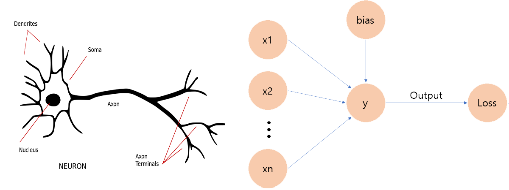

# Intro 

In the past decade as the technology had been advanced further, many algorithms that were only available as theories became  able to be implemented using advanced computers. Among them is a neural network that acts and behaves like our brain. It can perceive inputs, compute it in an unseeable manner and output (or send to another cell) a result that we see.

These days it is easy to hear or see in news about Artificial Intelligence, Artificial Neural Network(ANN), Convolutional Neural Network(CNN), Recurrent Neural Network(RNN), Generative Adversarial Network(GAN) and so on whose base structure is made up of smaller components of it called 'Perceptron'.

# What it is 

Let's first look at and compare images of a neuron cell and a perceptron below first.



A neuron cell consists of three main parts: One for receiving input, one for processing it through the other end and one for transmitting it to another. Same as this, a perceptron has the same structure. One for input, one for processing input to some arbitrary value, and one for output. 

The processing part is called 'Activation' that it activates and computes the input in a particular way and transmits to another.

A perceptron can take in two or more inputs and outputs some numerical value and based on this value, weight vectors are adjusted appropriately. Depending on the number of possible distinct output values, it acts as a binary or multi-class classifier.

The following is how it computes the label of each training point.
\begin{equation}
  f(x)=
  \begin{cases}
    1, & \text{if $wx + b > 0$}
    \\
    -1, & \text{if $wx + b < 0$}
  \end{cases}
\end{equation}

When <code>wx + b = 0</code> for a given data point, it means the data point is on the decision boundary (a line separating data) which we will deal with later in the post.

The whole process of a perceptron can be shown in three parts.<br>
1. Each input values are multiplied with weight vectors
2. Those multiplied values are then, summed up together.
3. Compute the sign of the final value and return either $1$ or $-1$

It is easy to see that the first and second step is just a dot product between a input vector and a weight vector.

Each weight vector is initialized with 0 values but there have been and are many on-going researches about initializing them with non-zero values to achieve faster convergence.

# Code 

As explained above, this behaves as a linear classifier and there are two cases when working with a perceptron. One case is when the data points is linearly separable and when it is not.

I will not deal with the second case because for this case, we have to use gradient descent but using such for a perceptron can be inefficient and since it is just a building block for a much bigger and better model.

Let's first look at how to implement a binary perceptron.

## Binary Classifier


```python
import numpy as np
import matplotlib.pyplot as plt
```


```python
class Perceptron():
    
    def __init__(self, num_class=2, max_iter=1000):
        
        # Check for appropriate classes and dimension
        assert num_class >= 2, "number of classes should be 2 or more"
        
        self.num_class = num_class
        self.max_iter = max_iter
        self.dim = None
        
    def _init_weights(self):
        
        self.weights = np.zeros(self.dim)
            
    def fit(self, x, y):
        
        # check label size matches training size
        assert len(x) == len(y), "x and y should have same length"
        
        if type(x) == list:
            x = np.array(x)
            
        self.dim = x.shape[1]
        self._init_weights()
        
        for i in range(self.max_iter):
            
            for x1, y1 in zip(x, y):
                changed = self._train(x1, y1)

            if not changed:
                print('Finished training at iteration {}'.format(i+1))
                break

    def _train(self, x, y):
        
        # Binary classifier
        pred = 1 if np.dot(self.weights, x) >= 0 else -1

        if pred != y:
            self.weights += x*y
            return True

        return False
            
    def predict(self, x):
        
        assert self.dim != None, "Must fit the model first"
        
        if type(x) == list:
            x = np.array([x])

        assert x.shape[1] == self.dim, "Trained Features and Predict Features do not match {} != {}".format(x.shape[1], self.dim)
        
        pred = np.array([])

        for x1 in x:
            res = np.dot(self.weights, x1)
            pred = np.append(pred, 1 if res >= 0 else -1)
                
        return pred
```

If you see above, I am updating a weight vector even when $wx + b = 0$ which means a data point is on the decision boundary. It is because we don't want to have any data points lying on the boundary to avoid being able to classify it as both $+1$ and $-1$.

Next we declare a perceptron and generate random points for training and testing.


```python
p = Perceptron()
```


```python
pos = [np.random.normal(1.5, 0.5, 30), np.random.normal(1.5, 0.5, 30)]
neg = [np.random.normal(-1.5, 0.5, 30), np.random.normal(-1.5, 0.5, 30)]

neg_y = np.array([-1]*30)
pos_y = np.ones(30)

X = np.append(pos, neg, axis=1).transpose()
y = np.append(pos_y, neg_y)
```

The points will lie on the graph like this.


```python
p.fit(X, y)
```

    Finished training at iteration 1
    

If we graph the points with decision boundary, it will look like the following.


Notice that when using a perceptron to classify data points, there are infinitely many possible solutions. For example, for the above data points, we could even use horizontal or vertical lines through the origin.

Now we check that the prediction of our data matches true labels.


```python
np.all(p.predict(X) == y)
```


    True


Also let's try using other data values.


```python
test = np.array([[1,1], [-3, 2], [5, 5], [-4, -2], [1, -3], [-3, 1]])
p.predict(test)
```


    array([ 1., -1.,  1., -1., -1., -1.])


It works great! One problem is that all the decision boundaries go through the origin since with the lack of bias term. 

To introduce bias, we add the constant 1 in weight vector. So any weight vector will have $[x_1, x_2, 1]$. Every update in iteration, we will either add or subtract 1 from the bias term. It's fine to use other value for the bias but depending on it, speed of convergence can differ.

Next we modify the class to add the bias term.


```python
class Perceptron():
    
    def __init__(self, num_class=2, max_iter=1000):
        
        # Check for appropriate classes and dimension
        assert num_class >= 2, "number of classes should be 2 or more"
        
        self.num_class = num_class
        self.max_iter = max_iter
        self.dim = None
        
    def _init_weights(self):

        self.weights = np.zeros(self.dim+1)
            
    def fit(self, x, y):
        
        assert len(x) == len(y), "x and y should have same length"
        
        if type(x) == list:
            x = np.array(x)
            
        self.dim = x.shape[1]
        self._init_weights()
        
        x = np.append(x, np.ones((len(x), 1)), axis=1)

        for i in range(self.max_iter):
            
            changed = self._train(x, y)
        
            if not changed:
                print('Finished training at iteration {}'.format(i+1))
                return

    def _train(self, x, y):

        changed = False
        prev = self.weights

        for x1, y1 in zip(x, y):
            pred = 1 if np.dot(self.weights, x1) >= 0 else -1

            if pred != y1:
                self.weights += x1*y1
                changed = True

        return changed
            
    def predict(self, x):
        
        assert self.dim != None, "Must fit the model first"
        
        if type(x) == list:
            x = np.array([x])
            
        assert x.shape[1] == self.dim, "Trained Features and Predict Features do not match {} != {}".format(x.shape[1], self.dim)
        
        x = np.append(x, np.ones((len(x), 1)), axis=1)
        
        pred = np.array([])
        
        for x1 in x:
            res = np.dot(self.weights, x1)
            pred = np.append(pred, 1 if res >= 0 else -1)
                
        return pred
    

```


```python
p = Perceptron()
```


```python
p.fit(X, y)
```

    Finished training at iteration 2
    


As seen, it works nicely and just to make sure, let's predict the X values and check pred values are same as y labels.


```python
pred = p.predict(X)
np.all(pred == y)
```


    True


```python
p.predict(test)
```


    array([ 1., -1.,  1., -1., -1., -1.])


In the following, I will show how to implement Multi-class Perceptron.

## Multi-class Classifier 

The only difference from the binary classifier is that when binary has only one weight vector (w or w/o bias term), multi-class has one weight vector for each label.

So if we want to make a model for 3 classes, we would have three different weight vectors corresponding to each of classes. To accommodate it, we only need to change how to initialize and update.


```python
class Perceptron():
    
    def __init__(self, num_class=2, max_iter=1000):
        
        # Check for appropriate classes and dimension
        assert num_class >= 2, "number of classes should be 2 or more"
        
        self.num_class = num_class
        self.max_iter = max_iter
        self.dim = None
        
    def _init_weights(self):

        # if classes >= 3, each class has its own weights vector
        if self.num_class == 2:
            self.weights = np.zeros(self.dim+1)
        else:
            self.weights = np.zeros((self.num_class, self.dim+1))
            
    def fit(self, x, y):
        
        assert x.shape[0] == len(y), "x and y should have same length"
        
        if type(x) == list:
            x = np.array(x)
        
        self.dim = x.shape[1]
        self._init_weights()
        
        x = np.append(x, np.ones((len(x), 1)), axis=1)

        for i in range(self.max_iter):
            
            changed = self._train(x, y)

            if not changed:
                print('Finished training at iteration {}'.format(i+1))
                return

    def _train(self, x, y):
        
        changed = False
        
        for x1, y1 in zip(x, y):
            
            # Binary 
            if self.num_class == 2:
                
                pred = 1 if np.dot(self.weights, x1) >= 0 else -1
                
                if pred != y1:
                    self.weights += x1*y1
                    changed = True
                  
            # Multi-class
            else:
                
                pred = np.argmax(np.dot(self.weights, x1))
                
                if pred != y1:
                    self.weights[int(y1)] += x1
                    self.weights[pred] -= x1
                    
                    changed =  True
                    
        return changed
            
    def predict(self, x):
        
        assert self.dim != None, "Must fit the model first"
        
        if type(x) == list:
            x = np.array([x])
            
        assert x.shape[1] == self.dim, "Trained Features and Predict Features do not match {} != {}".format(x.shape[1], self.dim)
        
        x = np.append(x, np.ones((len(x), 1)), axis=1)
        
        pred = np.array([])
        
        for x1 in x:
            res = np.dot(self.weights, x1)
            if self.num_class == 2:
                pred = np.append(pred, 1 if res >= 0 else -1)
            else:
                pred = np.append(pred, np.argmax(res))
                
        return pred
    
```


```python
size = 20

class1 = [np.random.normal(0, 0.5, size), np.random.normal(8, 0.5, size)]
class2 = [np.random.normal(-2, 0.5, size), np.random.normal(4, 0.5, size)]
class3 = [np.random.normal(2, 0.5, size), np.random.normal(4, 0.5, size)]

y1 = np.zeros((size, 1))
y2 = np.ones((size, 1))
y3 = np.ones((size, 1)) * 2

X = np.append(class1, np.append(class2, class3, axis=1), axis=1).transpose()
y = np.append(y1, np.append(y2, y3))
```

Generated data looks like this.


```python
p = Perceptron(num_class=3)
```


```python
p.fit(X, y)
```

    Finished training at iteration 22
    

If we draw a graph with distinct decision boundaries, it will be something like the following.


```python
np.all(p.predict(X) == y)
```


    True


Now let's test the model with three points (picked by hands).


```python
test = np.array([[-3, 3], [5, 2], [0, 10]])
p.predict(test)
```


    array([1., 2., 0.])


The reason that I have not generated random points is to make it easy to see and check the true label and predicted outcome. But it is fine to pick random points and test it as well and feel free to try.

# End Note 

This post is longer than others but it's not harder. Though a perceptron can work as a classifier, it's hard to see anyone actually using it for the purpose as it is merely a building block for a bigger model: Neural Network.

In later posts, I will talk more about this neural network with simple examples.

Thank you again all for reading and if there is any type of errors or typing errors, do let me know.
