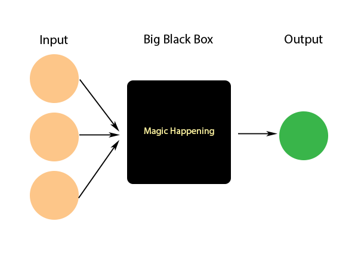
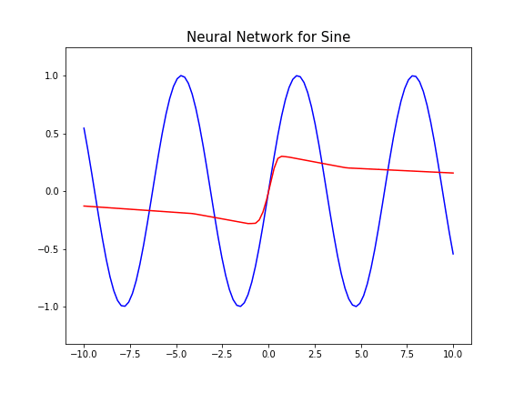
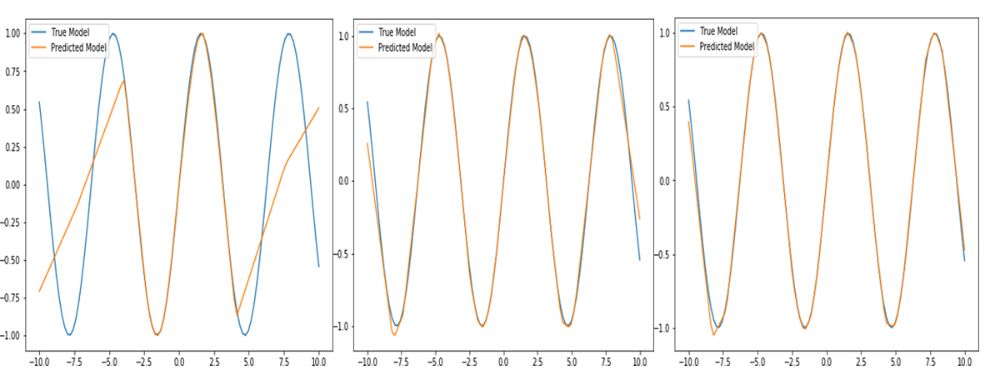

# Intro

Briefly introduced in the previous [post](https://tlr.gitbook.io/data-science/neural-network/perceptron), a neural network is made up of thousands or millions (or more) of perceptrons. A whole model of neural network can be thought as a function approximator that even though we don't know a true function, we can find a function that approximates the same or really close.

We cannot exactly see what work a neural network does or how it does, behind the scene, but with enough training it outputs a prediction(s). Because of this, sometimes we call neural network (or hidden layers between input and output) a black box.



A NN model starts as blank and as it iterates over training data, it updates and finds a better model.

Every time it outputs prediction values, it compares with a true y values and computes loss. With this and backpropagation technique, a model updates weights and biases in hidden layers to reduce next prediction's loss.

Backpropagation is a way of computing how much each hidden layer contributes to predicted values. For example we have a model with two hidden layers and first layer contributes 40% work to the output while the second does 60%. Then when we update weights of two layers, we update them with the same ratio. We don't want to punish a worker of two with equal amount when one of them was the main cause of a problem.

One good thing about neural network is, given substantial amount of data, we can find an approximate function that almost (or all) works as a true function. However this can also be one con of neural network that it needs large data. If the amount is small, it works poorly and using supervised or unsupervised algorithms will be much better instead.

A neural network has many different forms such as convolutional neural network, recurrent neural network, LSTM network, GANs and so many more. Here we will explore how to construct a basic neural network to find an approximate function for $f(x) = sin(x)$.



# Code 


```python
import numpy as np
import matplotlib.pyplot as plt
import tensorflow as tf
```

To make a model, we need to make a model function to pass into a tensorflow estimator.


```python
def sin_model(features, labels, mode):
    
    input_layer = features['x']
    
    dense1 = tf.layers.dense(input_layer, units=50, activation=tf.nn.relu)
    
    dense2 = tf.layers.dense(dense1, units=100, activation=tf.nn.relu)
    
    predictions = tf.layers.dense(dense2, units=1)
    
    if mode == tf.estimator.ModeKeys.PREDICT:
        return tf.estimator.EstimatorSpec(mode=mode, predictions=predictions)
    
    
    loss = tf.losses.mean_squared_error(labels, predictions)
    
    if mode == tf.estimator.ModeKeys.TRAIN:
        optimizer = tf.train.GradientDescentOptimizer(learning_rate=0.01)
        train_op = optimizer.minimize(loss=loss, global_step=tf.train.get_global_step())

        return tf.estimator.EstimatorSpec(mode=mode, loss=loss, train_op=train_op)
    
    eval_metric_ops = {'Mean Squared Error':tf.metrics.mean_squared_error(labels=labels, predictions=predictions)}
        
    return tf.estimator.EstimatorSpec(mode=mode, loss=loss, eval_metric_ops=eval_metric_ops)

```

The arguments in the function should be named exactly as the above or else it will throw an exception. For example if the name of 'features' is instead 'feature', it will throw <code>model_fn (<function sin_model at 0x0000025AB4112EA0>) must include features argument</code> exception.

In this model, we are only using two hidden layers of size 50 and 100 with biases and relu functions for activations.

You can modify these layers and hyperparameters to make a better function or to find a different approximation for different function.


```python
x = np.linspace(-10, 10, 100).reshape(-1, 1)
y = np.sin(x)
```

For the x values, I reshaped to (-1, 1) to make it in 2 dimensions as that is the least number of dimensions tensorflow expects. The first column value will be number of total samples and the second is to hold each of its values. Same goes for the y's shape as well.

We can save our model's checkpoints in the 'model' subdirectory.


```python
model = tf.estimator.Estimator(model_fn=sin_model, model_dir='./model/')

train_input_fn = tf.estimator.inputs.numpy_input_fn(
    x={'x':x},
    y=y,
    batch_size=25,
    num_epochs=None,
    shuffle=True
)

model.train(input_fn=train_input_fn, steps=30000)
```

    INFO:tensorflow:Using default config.
    INFO:tensorflow:Using config: {'_model_dir': './model/', '_tf_random_seed': None, '_save_summary_steps': 100, '_save_checkpoints_steps': None, '_save_checkpoints_secs': 600, '_session_config': None, '_keep_checkpoint_max': 5, '_keep_checkpoint_every_n_hours': 10000, '_log_step_count_steps': 100, '_train_distribute': None, '_device_fn': None, '_service': None, '_cluster_spec': <tensorflow.python.training.server_lib.ClusterSpec object at 0x000001C4DAF08E10>, '_task_type': 'worker', '_task_id': 0, '_global_id_in_cluster': 0, '_master': '', '_evaluation_master': '', '_is_chief': True, '_num_ps_replicas': 0, '_num_worker_replicas': 1}
    INFO:tensorflow:Calling model_fn.
    INFO:tensorflow:Done calling model_fn.
    INFO:tensorflow:Create CheckpointSaverHook.
    INFO:tensorflow:Graph was finalized.
    INFO:tensorflow:Running local_init_op.
    INFO:tensorflow:Done running local_init_op.
    INFO:tensorflow:Saving checkpoints for 0 into ./model/model.ckpt.
    INFO:tensorflow:loss = 1.1693605, step = 1
    INFO:tensorflow:global_step/sec: 615.047
    INFO:tensorflow:loss = 0.3964017, step = 101 (0.178 sec)
    INFO:tensorflow:global_step/sec: 628.388
    INFO:tensorflow:loss = 0.5454213, step = 201 (0.143 sec)
    INFO:tensorflow:global_step/sec: 444.542
    INFO:tensorflow:loss = 0.54093933, step = 301 (0.228 sec)
    INFO:tensorflow:global_step/sec: 552.513
    INFO:tensorflow:loss = 0.31625992, step = 401 (0.180 sec)
    INFO:tensorflow:global_step/sec: 671.134
    INFO:tensorflow:loss = 0.55106664, step = 501 (0.149 sec)
    INFO:tensorflow:global_step/sec: 341.298
    INFO:tensorflow:loss = 0.45055008, step = 601 (0.292 sec)
    INFO:tensorflow:global_step/sec: 664.378
    INFO:tensorflow:loss = 0.3125913, step = 701 (0.150 sec)
    INFO:tensorflow:global_step/sec: 869.243
    INFO:tensorflow:loss = 0.42734802, step = 801 (0.131 sec)
    INFO:tensorflow:global_step/sec: 679.325
    INFO:tensorflow:loss = 0.46488535, step = 901 (0.132 sec)
    INFO:tensorflow:global_step/sec: 447.661
    INFO:tensorflow:loss = 0.46080077, step = 1001 (0.225 sec)
    INFO:tensorflow:global_step/sec: 657.955
    INFO:tensorflow:loss = 0.525144, step = 1101 (0.151 sec)
    INFO:tensorflow:global_step/sec: 744.166
    INFO:tensorflow:loss = 0.45940307, step = 1201 (0.133 sec)
    INFO:tensorflow:global_step/sec: 809.286
    INFO:tensorflow:loss = 0.4792394, step = 1301 (0.124 sec)
    INFO:tensorflow:global_step/sec: 666.932
    INFO:tensorflow:loss = 0.44113934, step = 1401 (0.150 sec)
    INFO:tensorflow:global_step/sec: 729.513
    INFO:tensorflow:loss = 0.54012674, step = 1501 (0.138 sec)
    INFO:tensorflow:global_step/sec: 774.331
    INFO:tensorflow:loss = 0.3925196, step = 1601 (0.128 sec)
    INFO:tensorflow:global_step/sec: 671.679
    INFO:tensorflow:loss = 0.5673983, step = 1701 (0.149 sec)
    INFO:tensorflow:global_step/sec: 373.95
    INFO:tensorflow:loss = 0.35832942, step = 1801 (0.269 sec)
    INFO:tensorflow:global_step/sec: 420.143
    INFO:tensorflow:loss = 0.2950053, step = 1901 (0.241 sec)
    INFO:tensorflow:global_step/sec: 404.886
    INFO:tensorflow:loss = 0.50708634, step = 2001 (0.243 sec)
    INFO:tensorflow:global_step/sec: 452.424
    INFO:tensorflow:loss = 0.2770889, step = 2101 (0.223 sec)
    INFO:tensorflow:global_step/sec: 448.468
    INFO:tensorflow:loss = 0.20063315, step = 2201 (0.222 sec)
    INFO:tensorflow:global_step/sec: 487.833
    INFO:tensorflow:loss = 0.39950332, step = 2301 (0.204 sec)
    INFO:tensorflow:global_step/sec: 571.42
    INFO:tensorflow:loss = 0.63291305, step = 2401 (0.176 sec)
    INFO:tensorflow:global_step/sec: 613.486
    INFO:tensorflow:loss = 0.4434291, step = 2501 (0.162 sec)
    INFO:tensorflow:global_step/sec: 773.424
    INFO:tensorflow:loss = 0.2786645, step = 2601 (0.128 sec)
    INFO:tensorflow:global_step/sec: 631.871
    INFO:tensorflow:loss = 0.57014555, step = 2701 (0.160 sec)
    INFO:tensorflow:global_step/sec: 448.48
    INFO:tensorflow:loss = 0.3620307, step = 2801 (0.222 sec)
    INFO:tensorflow:global_step/sec: 546.456
    INFO:tensorflow:loss = 0.39409965, step = 2901 (0.183 sec)
    INFO:tensorflow:global_step/sec: 546.44
    INFO:tensorflow:loss = 0.32292202, step = 3001 (0.183 sec)
    INFO:tensorflow:global_step/sec: 546.455
    INFO:tensorflow:loss = 0.3842375, step = 3101 (0.184 sec)
    INFO:tensorflow:global_step/sec: 694.457
    INFO:tensorflow:loss = 0.46610376, step = 3201 (0.144 sec)
    INFO:tensorflow:global_step/sec: 636.93
    INFO:tensorflow:loss = 0.44859183, step = 3301 (0.157 sec)
    INFO:tensorflow:global_step/sec: 725.747
    INFO:tensorflow:loss = 0.39039946, step = 3401 (0.136 sec)
    INFO:tensorflow:global_step/sec: 767.639
    INFO:tensorflow:loss = 0.2295864, step = 3501 (0.130 sec)
    INFO:tensorflow:global_step/sec: 722.807
    INFO:tensorflow:loss = 0.35163155, step = 3601 (0.138 sec)
    INFO:tensorflow:global_step/sec: 536.054
    INFO:tensorflow:loss = 0.39750126, step = 3701 (0.191 sec)
    INFO:tensorflow:global_step/sec: 546.465
    INFO:tensorflow:loss = 0.3942647, step = 3801 (0.180 sec)
    INFO:tensorflow:global_step/sec: 632.885
    INFO:tensorflow:loss = 0.39685574, step = 3901 (0.158 sec)
    INFO:tensorflow:global_step/sec: 684.955
    INFO:tensorflow:loss = 0.40340343, step = 4001 (0.146 sec)
    INFO:tensorflow:global_step/sec: 492.61
    INFO:tensorflow:loss = 0.3072789, step = 4101 (0.204 sec)
    INFO:tensorflow:global_step/sec: 591.717
    INFO:tensorflow:loss = 0.38455048, step = 4201 (0.168 sec)
    INFO:tensorflow:global_step/sec: 467.287
    INFO:tensorflow:loss = 0.40930974, step = 4301 (0.214 sec)
    INFO:tensorflow:global_step/sec: 724.975
    INFO:tensorflow:loss = 0.30384004, step = 4401 (0.137 sec)
    INFO:tensorflow:global_step/sec: 768.641
    INFO:tensorflow:loss = 0.2610091, step = 4501 (0.130 sec)
    INFO:tensorflow:global_step/sec: 746.098
    INFO:tensorflow:loss = 0.27746016, step = 4601 (0.134 sec)
    INFO:tensorflow:global_step/sec: 753.698
    INFO:tensorflow:loss = 0.3013665, step = 4701 (0.133 sec)
    INFO:tensorflow:global_step/sec: 750.73
    INFO:tensorflow:loss = 0.2953122, step = 4801 (0.133 sec)
    INFO:tensorflow:global_step/sec: 841.491
    INFO:tensorflow:loss = 0.3374397, step = 4901 (0.134 sec)
    INFO:tensorflow:global_step/sec: 666.53
    INFO:tensorflow:loss = 0.28630126, step = 5001 (0.134 sec)
    INFO:tensorflow:global_step/sec: 754.183
    INFO:tensorflow:loss = 0.15456426, step = 5101 (0.133 sec)
    INFO:tensorflow:global_step/sec: 754.073
    INFO:tensorflow:loss = 0.16619873, step = 5201 (0.133 sec)
    INFO:tensorflow:global_step/sec: 750.762
    INFO:tensorflow:loss = 0.21090394, step = 5301 (0.133 sec)
    INFO:tensorflow:global_step/sec: 747.752
    INFO:tensorflow:loss = 0.32715702, step = 5401 (0.134 sec)
    INFO:tensorflow:global_step/sec: 749.289
    INFO:tensorflow:loss = 0.13289832, step = 5501 (0.133 sec)
    INFO:tensorflow:global_step/sec: 752.367
    INFO:tensorflow:loss = 0.1544956, step = 5601 (0.133 sec)
    INFO:tensorflow:global_step/sec: 754.84
    INFO:tensorflow:loss = 0.099889904, step = 5701 (0.132 sec)
    INFO:tensorflow:global_step/sec: 664.334
    INFO:tensorflow:loss = 0.22423781, step = 5801 (0.151 sec)
    INFO:tensorflow:global_step/sec: 750.497
    INFO:tensorflow:loss = 0.16308947, step = 5901 (0.133 sec)
    INFO:tensorflow:global_step/sec: 731.645
    INFO:tensorflow:loss = 0.31158498, step = 6001 (0.152 sec)
    INFO:tensorflow:global_step/sec: 664.112
    INFO:tensorflow:loss = 0.26237223, step = 6101 (0.136 sec)
    INFO:tensorflow:global_step/sec: 744.333
    INFO:tensorflow:loss = 0.17987108, step = 6201 (0.133 sec)
    INFO:tensorflow:global_step/sec: 676.872
    INFO:tensorflow:loss = 0.14478421, step = 6301 (0.148 sec)
    INFO:tensorflow:global_step/sec: 760.848
    INFO:tensorflow:loss = 0.2468964, step = 6401 (0.131 sec)
    INFO:tensorflow:global_step/sec: 754.156
    INFO:tensorflow:loss = 0.3526238, step = 6501 (0.133 sec)
    INFO:tensorflow:global_step/sec: 747.339
    INFO:tensorflow:loss = 0.2056705, step = 6601 (0.134 sec)
    INFO:tensorflow:global_step/sec: 747.946
    INFO:tensorflow:loss = 0.11660365, step = 6701 (0.134 sec)
    INFO:tensorflow:global_step/sec: 744.512
    INFO:tensorflow:loss = 0.074915186, step = 6801 (0.134 sec)
    INFO:tensorflow:global_step/sec: 658.827
    INFO:tensorflow:loss = 0.28019133, step = 6901 (0.152 sec)
    INFO:tensorflow:global_step/sec: 767.873
    INFO:tensorflow:loss = 0.13956791, step = 7001 (0.130 sec)
    INFO:tensorflow:global_step/sec: 653.922
    INFO:tensorflow:loss = 0.2179277, step = 7101 (0.153 sec)
    INFO:tensorflow:global_step/sec: 700.278
    INFO:tensorflow:loss = 0.26756287, step = 7201 (0.144 sec)
    INFO:tensorflow:global_step/sec: 822.006
    INFO:tensorflow:loss = 0.19228022, step = 7301 (0.121 sec)
    INFO:tensorflow:global_step/sec: 753.825
    INFO:tensorflow:loss = 0.22849335, step = 7401 (0.133 sec)
    INFO:tensorflow:global_step/sec: 756.405
    INFO:tensorflow:loss = 0.19416879, step = 7501 (0.132 sec)
    INFO:tensorflow:global_step/sec: 743.523
    INFO:tensorflow:loss = 0.26975796, step = 7601 (0.134 sec)
    INFO:tensorflow:global_step/sec: 757.944
    INFO:tensorflow:loss = 0.14996995, step = 7701 (0.132 sec)
    INFO:tensorflow:global_step/sec: 749.836
    INFO:tensorflow:loss = 0.09753572, step = 7801 (0.149 sec)
    INFO:tensorflow:global_step/sec: 743.152
    INFO:tensorflow:loss = 0.13798566, step = 7901 (0.135 sec)
    INFO:tensorflow:global_step/sec: 477.171
    INFO:tensorflow:loss = 0.2855475, step = 8001 (0.194 sec)
    INFO:tensorflow:global_step/sec: 589.207
    INFO:tensorflow:loss = 0.3059973, step = 8101 (0.185 sec)
    INFO:tensorflow:global_step/sec: 501.158
    INFO:tensorflow:loss = 0.101837724, step = 8201 (0.184 sec)
    INFO:tensorflow:global_step/sec: 505.89
    INFO:tensorflow:loss = 0.16519639, step = 8301 (0.198 sec)
    INFO:tensorflow:global_step/sec: 716.807
    INFO:tensorflow:loss = 0.20906241, step = 8401 (0.140 sec)
    INFO:tensorflow:global_step/sec: 500.177
    INFO:tensorflow:loss = 0.26442987, step = 8501 (0.201 sec)
    INFO:tensorflow:global_step/sec: 512.821
    INFO:tensorflow:loss = 0.059848674, step = 8601 (0.195 sec)
    INFO:tensorflow:global_step/sec: 529.105
    INFO:tensorflow:loss = 0.13322811, step = 8701 (0.190 sec)
    INFO:tensorflow:global_step/sec: 531.866
    INFO:tensorflow:loss = 0.20851061, step = 8801 (0.188 sec)
    INFO:tensorflow:global_step/sec: 815.145
    INFO:tensorflow:loss = 0.13098012, step = 8901 (0.136 sec)
    INFO:tensorflow:global_step/sec: 701.278
    INFO:tensorflow:loss = 0.15604737, step = 9001 (0.127 sec)
    INFO:tensorflow:global_step/sec: 760.171
    INFO:tensorflow:loss = 0.16370554, step = 9101 (0.132 sec)
    INFO:tensorflow:global_step/sec: 755.758
    INFO:tensorflow:loss = 0.22881447, step = 9201 (0.132 sec)
    INFO:tensorflow:global_step/sec: 763.625
    INFO:tensorflow:loss = 0.13471308, step = 9301 (0.131 sec)
    INFO:tensorflow:global_step/sec: 746.897
    INFO:tensorflow:loss = 0.111730866, step = 9401 (0.135 sec)
    INFO:tensorflow:global_step/sec: 758.379
    INFO:tensorflow:loss = 0.10601913, step = 9501 (0.131 sec)
    INFO:tensorflow:global_step/sec: 749.222
    INFO:tensorflow:loss = 0.10134181, step = 9601 (0.133 sec)
    INFO:tensorflow:global_step/sec: 848.546
    INFO:tensorflow:loss = 0.089378126, step = 9701 (0.133 sec)
    INFO:tensorflow:global_step/sec: 655.248
    INFO:tensorflow:loss = 0.066529796, step = 9801 (0.138 sec)
    INFO:tensorflow:global_step/sec: 757.77
    INFO:tensorflow:loss = 0.14272687, step = 9901 (0.131 sec)
    INFO:tensorflow:global_step/sec: 763.888
    INFO:tensorflow:loss = 0.12679411, step = 10001 (0.131 sec)
    INFO:tensorflow:global_step/sec: 740.791
    INFO:tensorflow:loss = 0.17406942, step = 10101 (0.151 sec)
    INFO:tensorflow:global_step/sec: 752.548
    INFO:tensorflow:loss = 0.20654982, step = 10201 (0.117 sec)
    INFO:tensorflow:global_step/sec: 747.26
    INFO:tensorflow:loss = 0.10767855, step = 10301 (0.134 sec)
    INFO:tensorflow:global_step/sec: 754.05
    INFO:tensorflow:loss = 0.14462954, step = 10401 (0.133 sec)
    INFO:tensorflow:global_step/sec: 740.467
    INFO:tensorflow:loss = 0.15167184, step = 10501 (0.135 sec)
    INFO:tensorflow:global_step/sec: 736.819
    INFO:tensorflow:loss = 0.16112153, step = 10601 (0.136 sec)
    INFO:tensorflow:global_step/sec: 774.64
    INFO:tensorflow:loss = 0.07227683, step = 10701 (0.129 sec)
    INFO:tensorflow:global_step/sec: 750.362
    INFO:tensorflow:loss = 0.04606751, step = 10801 (0.133 sec)
    INFO:tensorflow:global_step/sec: 843.332
    INFO:tensorflow:loss = 0.16314957, step = 10901 (0.119 sec)
    INFO:tensorflow:global_step/sec: 756.051
    INFO:tensorflow:loss = 0.12195847, step = 11001 (0.132 sec)
    INFO:tensorflow:global_step/sec: 752.58
    INFO:tensorflow:loss = 0.14640589, step = 11101 (0.133 sec)
    INFO:tensorflow:global_step/sec: 756.922
    INFO:tensorflow:loss = 0.07521779, step = 11201 (0.132 sec)
    INFO:tensorflow:global_step/sec: 720.068
    INFO:tensorflow:loss = 0.02725829, step = 11301 (0.141 sec)
    INFO:tensorflow:global_step/sec: 771.148
    INFO:tensorflow:loss = 0.076633215, step = 11401 (0.128 sec)
    INFO:tensorflow:global_step/sec: 757.08
    INFO:tensorflow:loss = 0.058220405, step = 11501 (0.132 sec)
    INFO:tensorflow:global_step/sec: 854.62
    INFO:tensorflow:loss = 0.050545674, step = 11601 (0.117 sec)
    INFO:tensorflow:global_step/sec: 744.394
    INFO:tensorflow:loss = 0.058454998, step = 11701 (0.134 sec)
    INFO:tensorflow:global_step/sec: 756.164
    INFO:tensorflow:loss = 0.12468714, step = 11801 (0.132 sec)
    INFO:tensorflow:global_step/sec: 743.736
    INFO:tensorflow:loss = 0.065710016, step = 11901 (0.134 sec)
    INFO:tensorflow:global_step/sec: 756.12
    INFO:tensorflow:loss = 0.0640346, step = 12001 (0.132 sec)
    INFO:tensorflow:global_step/sec: 818.586
    INFO:tensorflow:loss = 0.056325004, step = 12101 (0.122 sec)
    INFO:tensorflow:global_step/sec: 729.085
    INFO:tensorflow:loss = 0.051987294, step = 12201 (0.137 sec)
    INFO:tensorflow:global_step/sec: 773.427
    INFO:tensorflow:loss = 0.06363744, step = 12301 (0.129 sec)
    INFO:tensorflow:global_step/sec: 772.041
    INFO:tensorflow:loss = 0.02277086, step = 12401 (0.130 sec)
    INFO:tensorflow:global_step/sec: 756.972
    INFO:tensorflow:loss = 0.13090587, step = 12501 (0.132 sec)
    INFO:tensorflow:global_step/sec: 743.027
    INFO:tensorflow:loss = 0.09908928, step = 12601 (0.150 sec)
    INFO:tensorflow:global_step/sec: 763.598
    INFO:tensorflow:loss = 0.059980173, step = 12701 (0.115 sec)
    INFO:tensorflow:global_step/sec: 735.043
    INFO:tensorflow:loss = 0.02731379, step = 12801 (0.136 sec)
    INFO:tensorflow:global_step/sec: 651.237
    INFO:tensorflow:loss = 0.036887266, step = 12901 (0.155 sec)
    INFO:tensorflow:global_step/sec: 778.902
    INFO:tensorflow:loss = 0.060761385, step = 13001 (0.127 sec)
    INFO:tensorflow:global_step/sec: 742.129
    INFO:tensorflow:loss = 0.12201477, step = 13101 (0.135 sec)
    INFO:tensorflow:global_step/sec: 751.072
    INFO:tensorflow:loss = 0.10147778, step = 13201 (0.149 sec)
    INFO:tensorflow:global_step/sec: 754.8
    INFO:tensorflow:loss = 0.013911126, step = 13301 (0.117 sec)
    INFO:tensorflow:global_step/sec: 738.4
    INFO:tensorflow:loss = 0.04754704, step = 13401 (0.151 sec)
    INFO:tensorflow:global_step/sec: 673.524
    INFO:tensorflow:loss = 0.05388625, step = 13501 (0.133 sec)
    INFO:tensorflow:global_step/sec: 737.04
    INFO:tensorflow:loss = 0.030843617, step = 13601 (0.137 sec)
    INFO:tensorflow:global_step/sec: 755.764
    INFO:tensorflow:loss = 0.035281714, step = 13701 (0.131 sec)
    INFO:tensorflow:global_step/sec: 764.384
    INFO:tensorflow:loss = 0.03061793, step = 13801 (0.131 sec)
    INFO:tensorflow:global_step/sec: 740.461
    INFO:tensorflow:loss = 0.032095183, step = 13901 (0.135 sec)
    INFO:tensorflow:global_step/sec: 762.016
    INFO:tensorflow:loss = 0.053467263, step = 14001 (0.131 sec)
    INFO:tensorflow:global_step/sec: 850.939
    INFO:tensorflow:loss = 0.043484192, step = 14101 (0.133 sec)
    INFO:tensorflow:global_step/sec: 756.674
    INFO:tensorflow:loss = 0.0553027, step = 14201 (0.117 sec)
    INFO:tensorflow:global_step/sec: 747.12
    INFO:tensorflow:loss = 0.06173105, step = 14301 (0.134 sec)
    INFO:tensorflow:global_step/sec: 747.348
    INFO:tensorflow:loss = 0.04264078, step = 14401 (0.134 sec)
    INFO:tensorflow:global_step/sec: 752.207
    INFO:tensorflow:loss = 0.03403353, step = 14501 (0.133 sec)
    INFO:tensorflow:global_step/sec: 752.432
    INFO:tensorflow:loss = 0.05055798, step = 14601 (0.133 sec)
    INFO:tensorflow:global_step/sec: 724.575
    INFO:tensorflow:loss = 0.026379354, step = 14701 (0.154 sec)
    INFO:tensorflow:global_step/sec: 769.782
    INFO:tensorflow:loss = 0.016715843, step = 14801 (0.114 sec)
    INFO:tensorflow:global_step/sec: 759.463
    INFO:tensorflow:loss = 0.01893523, step = 14901 (0.132 sec)
    INFO:tensorflow:global_step/sec: 747.841
    INFO:tensorflow:loss = 0.04392401, step = 15001 (0.134 sec)
    INFO:tensorflow:global_step/sec: 728.048
    INFO:tensorflow:loss = 0.031211976, step = 15101 (0.137 sec)
    INFO:tensorflow:global_step/sec: 769.995
    INFO:tensorflow:loss = 0.021535572, step = 15201 (0.130 sec)
    INFO:tensorflow:global_step/sec: 794.153
    INFO:tensorflow:loss = 0.011931686, step = 15301 (0.126 sec)
    INFO:tensorflow:global_step/sec: 808.503
    INFO:tensorflow:loss = 0.024701936, step = 15401 (0.124 sec)
    INFO:tensorflow:global_step/sec: 741.136
    INFO:tensorflow:loss = 0.025638053, step = 15501 (0.135 sec)
    INFO:tensorflow:global_step/sec: 762.886
    INFO:tensorflow:loss = 0.019732744, step = 15601 (0.131 sec)
    INFO:tensorflow:global_step/sec: 743.894
    INFO:tensorflow:loss = 0.025385162, step = 15701 (0.134 sec)
    INFO:tensorflow:global_step/sec: 863.084
    INFO:tensorflow:loss = 0.05585168, step = 15801 (0.131 sec)
    INFO:tensorflow:global_step/sec: 731.697
    INFO:tensorflow:loss = 0.047610864, step = 15901 (0.137 sec)
    INFO:tensorflow:global_step/sec: 684.256
    INFO:tensorflow:loss = 0.021547044, step = 16001 (0.131 sec)
    INFO:tensorflow:global_step/sec: 608.459
    INFO:tensorflow:loss = 0.0032937839, step = 16101 (0.164 sec)
    INFO:tensorflow:global_step/sec: 741.499
    INFO:tensorflow:loss = 0.050146755, step = 16201 (0.135 sec)
    INFO:tensorflow:global_step/sec: 741.168
    INFO:tensorflow:loss = 0.021877978, step = 16301 (0.135 sec)
    INFO:tensorflow:global_step/sec: 755.266
    INFO:tensorflow:loss = 0.033727694, step = 16401 (0.132 sec)
    INFO:tensorflow:global_step/sec: 851.418
    INFO:tensorflow:loss = 0.004079698, step = 16501 (0.117 sec)
    INFO:tensorflow:global_step/sec: 723.314
    INFO:tensorflow:loss = 0.031162621, step = 16601 (0.138 sec)
    INFO:tensorflow:global_step/sec: 743.028
    INFO:tensorflow:loss = 0.006448284, step = 16701 (0.135 sec)
    INFO:tensorflow:global_step/sec: 792.399
    INFO:tensorflow:loss = 0.013131888, step = 16801 (0.126 sec)
    INFO:tensorflow:global_step/sec: 742.816
    INFO:tensorflow:loss = 0.011363639, step = 16901 (0.135 sec)
    INFO:tensorflow:global_step/sec: 851.326
    INFO:tensorflow:loss = 0.0026350736, step = 17001 (0.117 sec)
    INFO:tensorflow:global_step/sec: 762.703
    INFO:tensorflow:loss = 0.023023361, step = 17101 (0.131 sec)
    INFO:tensorflow:global_step/sec: 619.463
    INFO:tensorflow:loss = 0.009574985, step = 17201 (0.161 sec)
    INFO:tensorflow:global_step/sec: 815.779
    INFO:tensorflow:loss = 0.011601514, step = 17301 (0.123 sec)
    INFO:tensorflow:global_step/sec: 834.576
    INFO:tensorflow:loss = 0.0038928245, step = 17401 (0.120 sec)
    INFO:tensorflow:global_step/sec: 777.992
    INFO:tensorflow:loss = 0.028927857, step = 17501 (0.129 sec)
    INFO:tensorflow:global_step/sec: 740.59
    INFO:tensorflow:loss = 0.01322967, step = 17601 (0.135 sec)
    INFO:tensorflow:global_step/sec: 758.344
    INFO:tensorflow:loss = 0.0053496636, step = 17701 (0.132 sec)
    INFO:tensorflow:global_step/sec: 841.424
    INFO:tensorflow:loss = 0.017040059, step = 17801 (0.134 sec)
    INFO:tensorflow:global_step/sec: 669.521
    INFO:tensorflow:loss = 0.0044281897, step = 17901 (0.134 sec)
    INFO:tensorflow:global_step/sec: 851.782
    INFO:tensorflow:loss = 0.035729885, step = 18001 (0.117 sec)
    INFO:tensorflow:global_step/sec: 761.329
    INFO:tensorflow:loss = 0.0068944553, step = 18101 (0.131 sec)
    INFO:tensorflow:global_step/sec: 744.98
    INFO:tensorflow:loss = 0.006425253, step = 18201 (0.134 sec)
    INFO:tensorflow:global_step/sec: 846.73
    INFO:tensorflow:loss = 0.0050887326, step = 18301 (0.118 sec)
    INFO:tensorflow:global_step/sec: 751.226
    INFO:tensorflow:loss = 0.0186618, step = 18401 (0.133 sec)
    INFO:tensorflow:global_step/sec: 758.808
    INFO:tensorflow:loss = 0.0075203306, step = 18501 (0.132 sec)
    INFO:tensorflow:global_step/sec: 609.834
    INFO:tensorflow:loss = 0.005859115, step = 18601 (0.164 sec)
    INFO:tensorflow:global_step/sec: 824.636
    INFO:tensorflow:loss = 0.007243236, step = 18701 (0.137 sec)
    INFO:tensorflow:global_step/sec: 761.615
    INFO:tensorflow:loss = 0.026618764, step = 18801 (0.116 sec)
    INFO:tensorflow:global_step/sec: 728.259
    INFO:tensorflow:loss = 0.003273387, step = 18901 (0.138 sec)
    INFO:tensorflow:global_step/sec: 881.938
    INFO:tensorflow:loss = 0.006238041, step = 19001 (0.128 sec)
    INFO:tensorflow:global_step/sec: 667.195
    INFO:tensorflow:loss = 0.010490559, step = 19101 (0.134 sec)
    INFO:tensorflow:global_step/sec: 748.551
    INFO:tensorflow:loss = 0.011529139, step = 19201 (0.134 sec)
    INFO:tensorflow:global_step/sec: 756.186
    INFO:tensorflow:loss = 0.0026729964, step = 19301 (0.132 sec)
    INFO:tensorflow:global_step/sec: 852.335
    INFO:tensorflow:loss = 0.0367281, step = 19401 (0.117 sec)
    INFO:tensorflow:global_step/sec: 737.822
    INFO:tensorflow:loss = 0.018358843, step = 19501 (0.151 sec)
    INFO:tensorflow:global_step/sec: 719.843
    INFO:tensorflow:loss = 0.009569224, step = 19601 (0.123 sec)
    INFO:tensorflow:global_step/sec: 788.705
    INFO:tensorflow:loss = 0.0046077413, step = 19701 (0.127 sec)
    INFO:tensorflow:global_step/sec: 683.157
    INFO:tensorflow:loss = 0.099779785, step = 19801 (0.146 sec)
    INFO:tensorflow:global_step/sec: 842.991
    INFO:tensorflow:loss = 0.010147772, step = 19901 (0.119 sec)
    INFO:tensorflow:global_step/sec: 661.969
    INFO:tensorflow:loss = 0.015185038, step = 20001 (0.151 sec)
    INFO:tensorflow:global_step/sec: 756.115
    INFO:tensorflow:loss = 0.014035093, step = 20101 (0.132 sec)
    INFO:tensorflow:global_step/sec: 743.896
    INFO:tensorflow:loss = 0.00699253, step = 20201 (0.134 sec)
    INFO:tensorflow:global_step/sec: 756.303
    INFO:tensorflow:loss = 0.0036505563, step = 20301 (0.132 sec)
    INFO:tensorflow:global_step/sec: 723.131
    INFO:tensorflow:loss = 0.0023209718, step = 20401 (0.138 sec)
    INFO:tensorflow:global_step/sec: 752.377
    INFO:tensorflow:loss = 0.0070819175, step = 20501 (0.133 sec)
    INFO:tensorflow:global_step/sec: 682.902
    INFO:tensorflow:loss = 0.01428001, step = 20601 (0.146 sec)
    INFO:tensorflow:global_step/sec: 747.916
    INFO:tensorflow:loss = 0.0024899666, step = 20701 (0.134 sec)
    INFO:tensorflow:global_step/sec: 853.927
    INFO:tensorflow:loss = 0.044725835, step = 20801 (0.133 sec)
    INFO:tensorflow:global_step/sec: 757.624
    INFO:tensorflow:loss = 0.0058460645, step = 20901 (0.116 sec)
    INFO:tensorflow:global_step/sec: 741.628
    INFO:tensorflow:loss = 0.0018365236, step = 21001 (0.135 sec)
    INFO:tensorflow:global_step/sec: 759.435
    INFO:tensorflow:loss = 0.0032404454, step = 21101 (0.132 sec)
    INFO:tensorflow:global_step/sec: 742.469
    INFO:tensorflow:loss = 0.0058878222, step = 21201 (0.135 sec)
    INFO:tensorflow:global_step/sec: 739.972
    INFO:tensorflow:loss = 0.008054397, step = 21301 (0.135 sec)
    INFO:tensorflow:global_step/sec: 769.59
    INFO:tensorflow:loss = 0.07642072, step = 21401 (0.130 sec)
    INFO:tensorflow:global_step/sec: 738.698
    INFO:tensorflow:loss = 0.0645414, step = 21501 (0.135 sec)
    INFO:tensorflow:global_step/sec: 757.932
    INFO:tensorflow:loss = 0.00824388, step = 21601 (0.132 sec)
    INFO:tensorflow:global_step/sec: 718.172
    INFO:tensorflow:loss = 0.0032691937, step = 21701 (0.141 sec)
    INFO:tensorflow:global_step/sec: 787.608
    INFO:tensorflow:loss = 0.029172502, step = 21801 (0.125 sec)
    INFO:tensorflow:global_step/sec: 856.552
    INFO:tensorflow:loss = 0.0032427972, step = 21901 (0.132 sec)
    INFO:tensorflow:global_step/sec: 747.323
    INFO:tensorflow:loss = 0.022305366, step = 22001 (0.118 sec)
    INFO:tensorflow:global_step/sec: 747.857
    INFO:tensorflow:loss = 0.006047537, step = 22101 (0.134 sec)
    INFO:tensorflow:global_step/sec: 749.487
    INFO:tensorflow:loss = 0.003071041, step = 22201 (0.133 sec)
    INFO:tensorflow:global_step/sec: 758.879
    INFO:tensorflow:loss = 0.0025323527, step = 22301 (0.132 sec)
    INFO:tensorflow:global_step/sec: 744.357
    INFO:tensorflow:loss = 0.0041898587, step = 22401 (0.134 sec)
    INFO:tensorflow:global_step/sec: 736.537
    INFO:tensorflow:loss = 0.003236757, step = 22501 (0.136 sec)
    INFO:tensorflow:global_step/sec: 769.01
    INFO:tensorflow:loss = 0.0035818198, step = 22601 (0.130 sec)
    INFO:tensorflow:global_step/sec: 659.22
    INFO:tensorflow:loss = 0.015143871, step = 22701 (0.152 sec)
    INFO:tensorflow:global_step/sec: 853.549
    INFO:tensorflow:loss = 0.02278582, step = 22801 (0.133 sec)
    INFO:tensorflow:global_step/sec: 757.654
    INFO:tensorflow:loss = 0.0027519357, step = 22901 (0.116 sec)
    INFO:tensorflow:global_step/sec: 752.576
    INFO:tensorflow:loss = 0.028376086, step = 23001 (0.133 sec)
    INFO:tensorflow:global_step/sec: 745.58
    INFO:tensorflow:loss = 0.0024154, step = 23101 (0.134 sec)
    INFO:tensorflow:global_step/sec: 749.055
    INFO:tensorflow:loss = 0.014786828, step = 23201 (0.134 sec)
    INFO:tensorflow:global_step/sec: 740.171
    INFO:tensorflow:loss = 0.029417774, step = 23301 (0.151 sec)
    INFO:tensorflow:global_step/sec: 672.038
    INFO:tensorflow:loss = 0.017416734, step = 23401 (0.134 sec)
    INFO:tensorflow:global_step/sec: 856.25
    INFO:tensorflow:loss = 0.0047685034, step = 23501 (0.116 sec)
    INFO:tensorflow:global_step/sec: 754.096
    INFO:tensorflow:loss = 0.011683528, step = 23601 (0.133 sec)
    INFO:tensorflow:global_step/sec: 754.29
    INFO:tensorflow:loss = 0.0055092834, step = 23701 (0.133 sec)
    INFO:tensorflow:global_step/sec: 761.66
    INFO:tensorflow:loss = 0.0067935716, step = 23801 (0.131 sec)
    INFO:tensorflow:global_step/sec: 743.078
    INFO:tensorflow:loss = 0.0047083474, step = 23901 (0.135 sec)
    INFO:tensorflow:global_step/sec: 855.49
    INFO:tensorflow:loss = 0.0026433985, step = 24001 (0.117 sec)
    INFO:tensorflow:global_step/sec: 742.9
    INFO:tensorflow:loss = 0.0037044154, step = 24101 (0.135 sec)
    INFO:tensorflow:global_step/sec: 744.401
    INFO:tensorflow:loss = 0.0029573415, step = 24201 (0.134 sec)
    INFO:tensorflow:global_step/sec: 758.793
    INFO:tensorflow:loss = 0.0038000299, step = 24301 (0.147 sec)
    INFO:tensorflow:global_step/sec: 758.782
    INFO:tensorflow:loss = 0.0044790036, step = 24401 (0.116 sec)
    INFO:tensorflow:global_step/sec: 741.323
    INFO:tensorflow:loss = 0.0014273357, step = 24501 (0.135 sec)
    INFO:tensorflow:global_step/sec: 755.525
    INFO:tensorflow:loss = 0.0019797087, step = 24601 (0.132 sec)
    INFO:tensorflow:global_step/sec: 753.639
    INFO:tensorflow:loss = 0.0062422846, step = 24701 (0.133 sec)
    INFO:tensorflow:global_step/sec: 858.191
    INFO:tensorflow:loss = 0.003092712, step = 24801 (0.117 sec)
    INFO:tensorflow:global_step/sec: 796.435
    INFO:tensorflow:loss = 0.007134604, step = 24901 (0.126 sec)
    INFO:tensorflow:global_step/sec: 791.684
    INFO:tensorflow:loss = 0.0033830053, step = 25001 (0.126 sec)
    INFO:tensorflow:global_step/sec: 748.474
    INFO:tensorflow:loss = 0.0018391131, step = 25101 (0.134 sec)
    INFO:tensorflow:global_step/sec: 760.437
    INFO:tensorflow:loss = 0.004972935, step = 25201 (0.132 sec)
    INFO:tensorflow:global_step/sec: 853.835
    INFO:tensorflow:loss = 0.0046727667, step = 25301 (0.117 sec)
    INFO:tensorflow:global_step/sec: 746.607
    INFO:tensorflow:loss = 0.00514182, step = 25401 (0.150 sec)
    INFO:tensorflow:global_step/sec: 749.113
    INFO:tensorflow:loss = 0.003968125, step = 25501 (0.133 sec)
    INFO:tensorflow:global_step/sec: 676.584
    INFO:tensorflow:loss = 0.0045156754, step = 25601 (0.132 sec)
    INFO:tensorflow:global_step/sec: 842.487
    INFO:tensorflow:loss = 0.0053827823, step = 25701 (0.119 sec)
    INFO:tensorflow:global_step/sec: 760.578
    INFO:tensorflow:loss = 0.0018672859, step = 25801 (0.131 sec)
    INFO:tensorflow:global_step/sec: 836.69
    INFO:tensorflow:loss = 0.011257965, step = 25901 (0.120 sec)
    INFO:tensorflow:global_step/sec: 763.584
    INFO:tensorflow:loss = 0.0042563984, step = 26001 (0.131 sec)
    INFO:tensorflow:global_step/sec: 851.392
    INFO:tensorflow:loss = 0.0020977124, step = 26101 (0.117 sec)
    INFO:tensorflow:global_step/sec: 750.91
    INFO:tensorflow:loss = 0.0014011004, step = 26201 (0.133 sec)
    INFO:tensorflow:global_step/sec: 747.705
    INFO:tensorflow:loss = 0.0035260038, step = 26301 (0.134 sec)
    INFO:tensorflow:global_step/sec: 747.202
    INFO:tensorflow:loss = 0.01169683, step = 26401 (0.134 sec)
    INFO:tensorflow:global_step/sec: 733.294
    INFO:tensorflow:loss = 0.0028107166, step = 26501 (0.136 sec)
    INFO:tensorflow:global_step/sec: 776.27
    INFO:tensorflow:loss = 0.002493411, step = 26601 (0.129 sec)
    INFO:tensorflow:global_step/sec: 756.146
    INFO:tensorflow:loss = 0.008098825, step = 26701 (0.132 sec)
    INFO:tensorflow:global_step/sec: 742.353
    INFO:tensorflow:loss = 0.0063822065, step = 26801 (0.135 sec)
    INFO:tensorflow:global_step/sec: 747.017
    INFO:tensorflow:loss = 0.0015823575, step = 26901 (0.134 sec)
    INFO:tensorflow:global_step/sec: 756.394
    INFO:tensorflow:loss = 0.0019730562, step = 27001 (0.132 sec)
    INFO:tensorflow:global_step/sec: 847.887
    INFO:tensorflow:loss = 0.0027956478, step = 27101 (0.118 sec)
    INFO:tensorflow:global_step/sec: 754.654
    INFO:tensorflow:loss = 0.005152549, step = 27201 (0.133 sec)
    INFO:tensorflow:global_step/sec: 744.189
    INFO:tensorflow:loss = 0.0059250584, step = 27301 (0.134 sec)
    INFO:tensorflow:global_step/sec: 761.081
    INFO:tensorflow:loss = 0.0030539515, step = 27401 (0.131 sec)
    INFO:tensorflow:global_step/sec: 848.488
    INFO:tensorflow:loss = 0.013084195, step = 27501 (0.118 sec)
    INFO:tensorflow:global_step/sec: 756.912
    INFO:tensorflow:loss = 0.0012356095, step = 27601 (0.132 sec)
    INFO:tensorflow:global_step/sec: 739.628
    INFO:tensorflow:loss = 0.009265877, step = 27701 (0.135 sec)
    INFO:tensorflow:global_step/sec: 756.416
    INFO:tensorflow:loss = 0.001429386, step = 27801 (0.132 sec)
    INFO:tensorflow:global_step/sec: 748.945
    INFO:tensorflow:loss = 0.0015115881, step = 27901 (0.134 sec)
    INFO:tensorflow:global_step/sec: 676.639
    INFO:tensorflow:loss = 0.0024581088, step = 28001 (0.151 sec)
    INFO:tensorflow:global_step/sec: 840.017
    INFO:tensorflow:loss = 0.0015818877, step = 28101 (0.116 sec)
    INFO:tensorflow:global_step/sec: 747.057
    INFO:tensorflow:loss = 0.00981664, step = 28201 (0.134 sec)
    INFO:tensorflow:global_step/sec: 860.903
    INFO:tensorflow:loss = 0.0043562637, step = 28301 (0.116 sec)
    INFO:tensorflow:global_step/sec: 744.491
    INFO:tensorflow:loss = 0.002198817, step = 28401 (0.134 sec)
    INFO:tensorflow:global_step/sec: 759.518
    INFO:tensorflow:loss = 0.0033808474, step = 28501 (0.132 sec)
    INFO:tensorflow:global_step/sec: 849.02
    INFO:tensorflow:loss = 0.0027552533, step = 28601 (0.118 sec)
    INFO:tensorflow:global_step/sec: 755.441
    INFO:tensorflow:loss = 0.0011715645, step = 28701 (0.132 sec)
    INFO:tensorflow:global_step/sec: 806.166
    INFO:tensorflow:loss = 0.0041882293, step = 28801 (0.140 sec)
    INFO:tensorflow:global_step/sec: 702.676
    INFO:tensorflow:loss = 0.0022828153, step = 28901 (0.127 sec)
    INFO:tensorflow:global_step/sec: 844.66
    INFO:tensorflow:loss = 0.0030260377, step = 29001 (0.118 sec)
    INFO:tensorflow:global_step/sec: 753.193
    INFO:tensorflow:loss = 0.0013979883, step = 29101 (0.133 sec)
    INFO:tensorflow:global_step/sec: 751.63
    INFO:tensorflow:loss = 0.001428826, step = 29201 (0.133 sec)
    INFO:tensorflow:global_step/sec: 857.785
    INFO:tensorflow:loss = 0.0060562897, step = 29301 (0.132 sec)
    INFO:tensorflow:global_step/sec: 753.948
    INFO:tensorflow:loss = 0.0057939864, step = 29401 (0.117 sec)
    INFO:tensorflow:global_step/sec: 747.393
    INFO:tensorflow:loss = 0.0010722036, step = 29501 (0.134 sec)
    INFO:tensorflow:global_step/sec: 833.096
    INFO:tensorflow:loss = 0.0013768066, step = 29601 (0.120 sec)
    INFO:tensorflow:global_step/sec: 676.952
    INFO:tensorflow:loss = 0.0023964667, step = 29701 (0.148 sec)
    INFO:tensorflow:global_step/sec: 756.899
    INFO:tensorflow:loss = 0.0010435522, step = 29801 (0.132 sec)
    INFO:tensorflow:global_step/sec: 856.409
    INFO:tensorflow:loss = 0.0026557748, step = 29901 (0.117 sec)
    INFO:tensorflow:Saving checkpoints for 30000 into ./model/model.ckpt.
    INFO:tensorflow:Loss for final step: 0.0019341598.
    


    <tensorflow.python.estimator.estimator.Estimator at 0x1c4daf08a90>


Now that the model is trained, let's check how much error(Mean Squared Error) we make with the same x and y values.


```python
eval_fn = tf.estimator.inputs.numpy_input_fn(
    x={'x':x},
    y=y,
    shuffle=False,
    num_epochs=1
)

list(model.evaluate(eval_fn))
```

    INFO:tensorflow:Calling model_fn.
    INFO:tensorflow:Done calling model_fn.
    INFO:tensorflow:Starting evaluation at 2018-12-28-03:31:33
    INFO:tensorflow:Graph was finalized.
    INFO:tensorflow:Restoring parameters from ./model/model.ckpt-30000
    INFO:tensorflow:Running local_init_op.
    INFO:tensorflow:Done running local_init_op.
    INFO:tensorflow:Finished evaluation at 2018-12-28-03:31:33
    INFO:tensorflow:Saving dict for global step 30000: Mean Squared Error = 0.0044636456, global_step = 30000, loss = 0.0044636456
    INFO:tensorflow:Saving 'checkpoint_path' summary for global step 30000: ./model/model.ckpt-30000
    


    ['Mean Squared Error', 'loss', 'global_step']


Our MSE value is 0.0015171621. This value can be different depending on parameters.

Now to predict with the same x values, do the following.


```python
pred_fn = tf.estimator.inputs.numpy_input_fn(
    x={'x':x},
    y=None,
    shuffle=False,
    num_epochs=1
)
pred = list(model.predict(pred_fn))
```

    INFO:tensorflow:Calling model_fn.
    INFO:tensorflow:Done calling model_fn.
    INFO:tensorflow:Graph was finalized.
    INFO:tensorflow:Restoring parameters from ./model/model.ckpt-30000
    INFO:tensorflow:Running local_init_op.
    INFO:tensorflow:Done running local_init_op.
    

First five of prediction values.


```python
pred[:5]
```


    [array([0.37037055]),
     array([0.2057652]),
     array([0.04115985]),
     array([-0.1234455]),
     array([-0.28805085])]


These are the graph of predicted values after 10000, 20000 and 30000 iterations.



Though I stopped training after 30000 iterations, you can do more with different parameters to find an exact sine function.

Usually, if a given function is not so complex such as image classification or else, a model with two hidden layers (w or w/o bias) and relu functions is enough to find an approximator.

***

When we work with a neural network, we encounter the terms steps, batch size and epoch(s).

One epoch means one iteration over the whole training samples. A step is iterating once over one batch samples. For example if we have 1000 samples and batch size is 100, for 5 epochs we need 50 steps. It could be thought as $$\# Steps = \frac{Total Samples}{Batch Size} * Epoch(s)$$

Above we used batch size of 50 and steps of 10000 while epoch was <code>None</code>. When <code>None</code> value is passed as epoch, it will iterate as many times as it needs until reaching 10000 steps.

Though some concepts were not explained in this post such as backpropagation, activation functions, computation graph and others, it will be covered in later posts.

Thank you all for reading this and let me know if there is a typo(s) or error(s).
