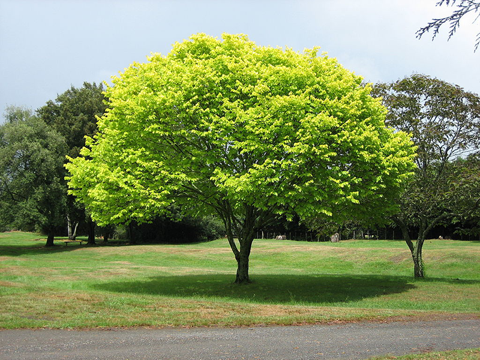
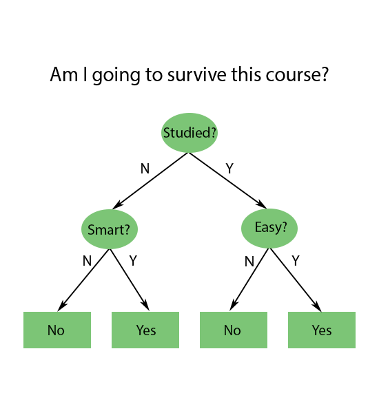
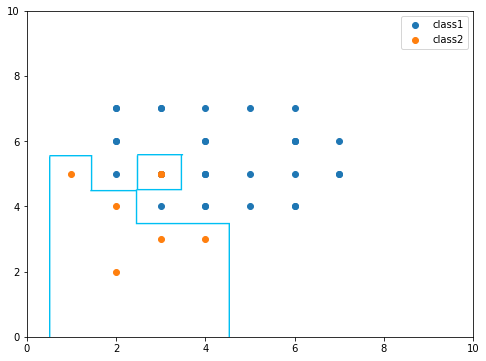

There are many supervised machine learning techniques and among them is one that is easy to interpret and understand. A Decision Tree!

As the name 'Tree' suggests, it is shaped just like a tree just and in general have the following structure.



Each ellipses and rectangles are called nodes of a tree and nodes right under another node are called child nodes. In this example, ellipses are called decision nodes while rectangles are called end nodes (or leaf nodes). The end nodes are results that we get after going through a decision tree and each decision node divides a feature and splits it into two or more child nodes.

In above only three factors are considered but of course, there are many more that impact results such as how many hours studied, if one has a good condition on an exam day, etc.. 

Those factors or features can be discrete as above or continuous and numeric or non-numeric (such as categories in string format) and based on the type of results, the decision tree can either be a classifier or regressor.

There are several algorithms in decision trees such as ID3, C4.5, CART, CHAID, MARS and Conditional Inference Trees but in this post, we will go through CART (Classifier And Regressor Tree) which each node can only have two children.

For this post we will use one of well-known data sets for decision tree tutorial, Iris data set and we can easily load the data from sklearn.


```python
import numpy as np
import pandas as pd
import matplotlib.pyplot as plt

from sklearn.datasets import load_iris
```


```python
iris = load_iris()

features = iris.feature_names
target = iris.target_names

X = pd.DataFrame(iris.data, columns=features)
y = pd.DataFrame(iris.target, columns=['class'])
```

I've converted the data to a pandas dataframe but this step can be ignored if you don't want to.

If we inspect the data, there are four features and three classes.


```python
data.head()
```


<div>
<style scoped>
    .dataframe tbody tr th:only-of-type {
        vertical-align: middle;
    }

    .dataframe tbody tr th {
        vertical-align: top;
    }

    .dataframe thead th {
        text-align: right;
    }
</style>
<table border="1" class="dataframe">
  <thead>
    <tr style="text-align: right;">
      <th></th>
      <th>sepal length (cm)</th>
      <th>sepal width (cm)</th>
      <th>petal length (cm)</th>
      <th>petal width (cm)</th>
    </tr>
  </thead>
  <tbody>
    <tr>
      <th>0</th>
      <td>5.1</td>
      <td>3.5</td>
      <td>1.4</td>
      <td>0.2</td>
    </tr>
    <tr>
      <th>1</th>
      <td>4.9</td>
      <td>3.0</td>
      <td>1.4</td>
      <td>0.2</td>
    </tr>
    <tr>
      <th>2</th>
      <td>4.7</td>
      <td>3.2</td>
      <td>1.3</td>
      <td>0.2</td>
    </tr>
    <tr>
      <th>3</th>
      <td>4.6</td>
      <td>3.1</td>
      <td>1.5</td>
      <td>0.2</td>
    </tr>
    <tr>
      <th>4</th>
      <td>5.0</td>
      <td>3.6</td>
      <td>1.4</td>
      <td>0.2</td>
    </tr>
  </tbody>
</table>
</div>


```python
list(target)
```


    ['setosa', 'versicolor', 'virginica']


For simplicity, we will only use the first two features, sepal length and sepal width and two classes, setosa and versicolor.


```python
y = y.loc[y['class'].isin([0,1])]
X = X.iloc[y.index, :2]
```

Splitting points in decision trees are boundaries that divides data into partitions.

The main goal of a decision tree is to figure out where to set these splitting points on features and return a result(s) with no or the least mis-classification (or error/loss from regression). Let's check out the samples for two classes.


To separate above points, we could draw lines like this.


We can separate them nicely with 5 boundaries (in green) or 5 decision nodes. The red line is the final boundary. Two nodes are drawn on Sepal Width feature and the rest on Sepal Length. In a tree structure, it looks like the following. The range of splitting points above and below will be different as the ones above are chosen arbitrarily.


We could also interpret a decision tree as a multiple combination of if else statements. A tree doesn't have to be balanced (left and right side looking the same) and can have more children on left side (or right).  

When deciding where to split samples, it doesn't just pick a point to split data but instead pick one that gives us the most information.

Consider the following example.


On the right we could perfectly separate red and blue with a single line while on the left it didn't and we have to add one more line. We could say we have gathered more data with a vertical line than a horizontal and this gain is called information gain. 

So when we decide splitting points, we first need to know how much information we can get with numerous different points. There are a few ways to measure but in this post, we will use Gini index (or Gini coefficient or Gini impurity) used in CART which is very simple. $$Impurity = 1 - p^2$$ where $p$ is the fraction of a class (either red or blue in above plot) being in a set. The lower it is, the purer (classified correctly) it is. If we use horizontal line as in the left side, impurity value for blue will be $2/6$. And if we use a vertical it will be $0$. So we choose the lower value from having the vertical line. 

Now that we have a way of measuring this impurity, how do we pick points so that we can measure the impurity?

A midpoint between two adjacent points is picked. If we have five distinct values along x-axis, there are four midpoints among them and to draw lines. So there are 4 distinct vertical lines and 4 distinct horizontal lines in above figure and with those, we could create numerous combinations. 

Let's now try with a different example that we cannot divide two classes in a clean way.


We see that a point in class 2 is placed among points in class 1 and if we draw lines to perfectly classify them, it will be like this.



Though it can classify two classes nicely, this is overfitting. It is likely that the point of class 2 resides among points of class 1 due to some noise but in fact, that region or area is class 1. This will later mis-classify class 1 as class 2 when it isn't.

To fight against this,once a model makes a fully-grown tree (after making boundaries like above), it prunes its nodes to have a simpler model (fewer nodes). By doing this, it will produce higher error in training but will reduce the error in testing.

Just like there are ways to decide which splitting points to pick, there are ways to determine which nodes of a tree to prune.

We could set a maximum depth of a tree that upon reaching that level, it doesn't split anymore. Another way is, based on results of cross validation at each node, to remove ones that don't change result much. Pruning after building a tree is called post-pruning. There is also early stopping or pre-pruning that at each level, it cross validates a model and checks if splitting will decrease the error. If it doesn't by some factor, it stops or else continues until it doesn't.

Building a model is really easy.


```python
from sklearn.tree import DecisionTreeClassifier
from sklearn.model_selection import train_test_split
from sklearn.metrics import accuracy_score

X_train, X_val, y_train, y_val = train_test_split(X, y)

model = DecisionTreeClassifier()
model.fit(X_train, y_train)

print(f'Accuracy : {accuracy_score(y_val, model.predict(X_val)) * 100}')
```

    Accuracy : 100.0
    

Note that depending on which data points are sampled from <code>train_test_split</code>, the accuracy could vary as it is possible in some cases two different samples are placed closely that a tight boundary is needed to divide them. This is another reason to use cross validation.

We only talked about CART classification but regression is almost the same. The only difference is that in regressor, we use SSE (Sum of Square Errors) to find splitting points instead of Gini. This SSE is computed with target (dependent) value  and has the formula $$SSE = \sum_i(y_i - \overline{y})^2 + \sum_j(y_j - \overline{y})^2$$ where $\overline{y}$ is the mean of $y$'s and $\sum_i$ and $\sum_j$ are two partitions generated by splitting.

Let's look at a simple example from sklearn page.


You can find the code of plotting [here](https://scikit-learn.org/stable/auto_examples/tree/plot_tree_regression.html).

It first finds an appropriate midpoint of data (x-axis) and using $SSE$, finds a splitting point on target (y-axis). It repeats the same procedure until reaching the maximum depth specified or until no further improvement can be made. Above, the maximum depth is 2. Because the depth is 2, there are only three decision nodes (vertical lines) and four end nodes (horizontal).

# End note

When classifying data such as iris data set, we can use another supervised machine learning called SVM (Support Vector Machine) as it is another good technique for classification, especially when given data samples are not linearly separable and this technique will be covered later.

So why do we use this decision tree technique?

There are some reasons to that. 
1. It is easy to interpret how it works as it is just bunch of if else statement that one can follow the logic behind by looking at the structure of a tree. 
2. Computing a model is fast.
3. It can work with data with missing values. In this case, once it reaches a node that no traversing further down is possible, it returns an average value (or mode in case of classification) of children nodes of that node. 
4. It is scale invariant meaning it doesn't matter if we scale or not.

But then, there are also cons. One is that it may not be so accurate and another is its variance. One small change in decision nodes can change the whole outcome of its children. 

I hope this helps you understanding how decision tree works better and next, we will talk about random forest ensemble which is a collection of many decision tree models. 

Thank you!!
