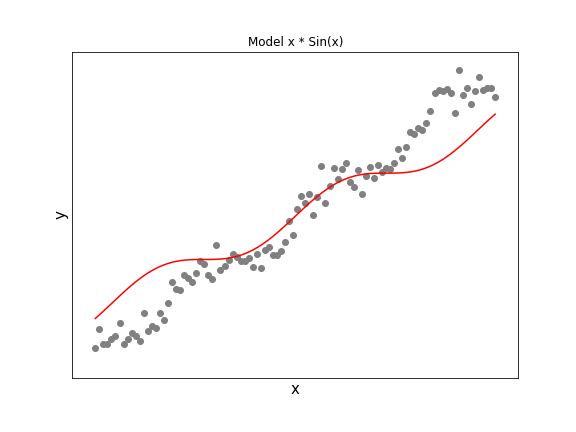
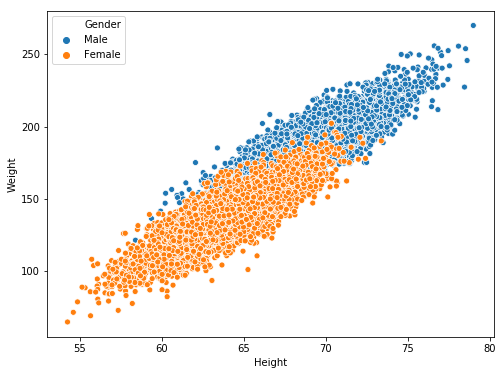
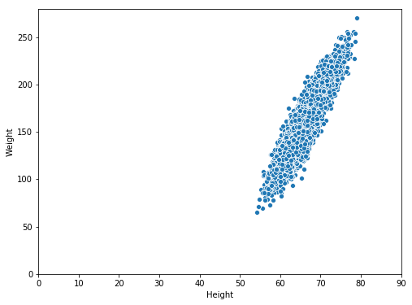
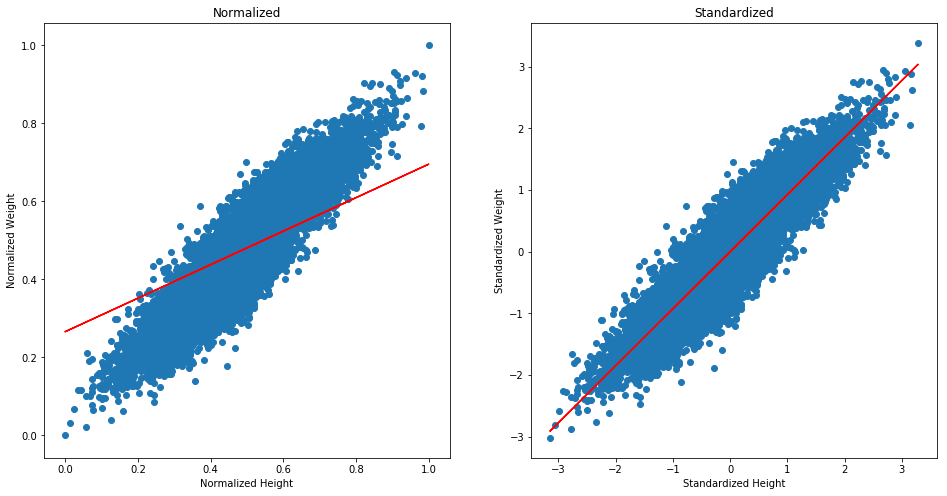
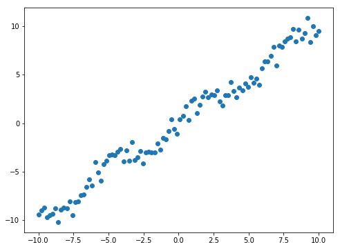
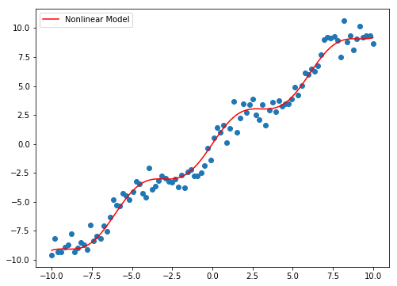

# What is it?

Simply put, linear regression is building a model that to a line that fits data samples with the least loss values.

To do so, a model should figure out a proper relation, if there exists, between independent (x) and dependent values (y). This relation could be proportional or not or no relation at all.

As with other machine learning examples, it is impossible to predict something with no errors, so our goal is to build a model that produces the least possible loss values which is done by computing the difference between actual and predicted values.

One naive loss function can be $$loss = \sum_i^N(y - \hat y_i)$$ where $\hat y_i$ is the predicted values and $N$ is the number of samples. <br>In this post, we will use Mean Squared Error function $$MSE = \frac{1}{N}\lVert \hat y - y \rVert_2^2$$.

# Data Exploration

Let's say we would like to know the relation between the height and weight of a person.

We can already tell that the taller the person is, the heavier the weight gets. Let's find out if this is true.

The data we are going to use is from [Kaggle's weight-height](https://www.kaggle.com/mustafaali96/weight-height) uploaded by Mustafa Ali.


```python
data[data['Gender'] == 'Male'].head(2)
```


<div>
<style scoped>
    .dataframe tbody tr th:only-of-type {
        vertical-align: middle;
    }

    .dataframe tbody tr th {
        vertical-align: top;
    }

    .dataframe thead th {
        text-align: right;
    }
</style>
<table border="1" class="dataframe">
  <thead>
    <tr style="text-align: right;">
      <th></th>
      <th>Gender</th>
      <th>Height</th>
      <th>Weight</th>
    </tr>
  </thead>
  <tbody>
    <tr>
      <th>0</th>
      <td>Male</td>
      <td>73.847017</td>
      <td>241.893563</td>
    </tr>
    <tr>
      <th>1</th>
      <td>Male</td>
      <td>68.781904</td>
      <td>162.310473</td>
    </tr>
  </tbody>
</table>
</div>


```python
data[data['Gender'] == 'Female'].head(2)
```


<div>
<style scoped>
    .dataframe tbody tr th:only-of-type {
        vertical-align: middle;
    }

    .dataframe tbody tr th {
        vertical-align: top;
    }

    .dataframe thead th {
        text-align: right;
    }
</style>
<table border="1" class="dataframe">
  <thead>
    <tr style="text-align: right;">
      <th></th>
      <th>Gender</th>
      <th>Height</th>
      <th>Weight</th>
    </tr>
  </thead>
  <tbody>
    <tr>
      <th>5000</th>
      <td>Female</td>
      <td>58.910732</td>
      <td>102.088326</td>
    </tr>
    <tr>
      <th>5001</th>
      <td>Female</td>
      <td>65.230013</td>
      <td>141.305823</td>
    </tr>
  </tbody>
</table>
</div>


```python
data.shape
```


    (10000, 3)


We have 10,000 data samples and gener, height and weight features.


```python
data.describe()
```


<div>
<style scoped>
    .dataframe tbody tr th:only-of-type {
        vertical-align: middle;
    }

    .dataframe tbody tr th {
        vertical-align: top;
    }

    .dataframe thead th {
        text-align: right;
    }
</style>
<table border="1" class="dataframe">
  <thead>
    <tr style="text-align: right;">
      <th></th>
      <th>Height</th>
      <th>Weight</th>
    </tr>
  </thead>
  <tbody>
    <tr>
      <th>count</th>
      <td>10000.000000</td>
      <td>10000.000000</td>
    </tr>
    <tr>
      <th>mean</th>
      <td>66.367560</td>
      <td>161.440357</td>
    </tr>
    <tr>
      <th>std</th>
      <td>3.847528</td>
      <td>32.108439</td>
    </tr>
    <tr>
      <th>min</th>
      <td>54.263133</td>
      <td>64.700127</td>
    </tr>
    <tr>
      <th>25%</th>
      <td>63.505620</td>
      <td>135.818051</td>
    </tr>
    <tr>
      <th>50%</th>
      <td>66.318070</td>
      <td>161.212928</td>
    </tr>
    <tr>
      <th>75%</th>
      <td>69.174262</td>
      <td>187.169525</td>
    </tr>
    <tr>
      <th>max</th>
      <td>78.998742</td>
      <td>269.989699</td>
    </tr>
  </tbody>
</table>
</div>




It seems that our assumption is right. The weight increases as the height does. Also by the looks of it, we could just ignore gender and treat the samples as one bigger group since one line could still fit pretty decently.

If we zoom out and view the height and weight samples (of male and female), it looks like this.



So surely, we cannot fit a line that goes through the origin to the samples.

# Code

## Using Gradient Descent

As mentioned in [Gradient Descent](https://tlr.gitbook.io/data-science/machine-learning-basics/gradient-descent) post, we first have to choose which loss function we are going to use and define partial derivatives. 

Let's reuse the codes from the post and try running gradient descent.


```python
# Loss function
def mse(y, x, w, b):
    
    return np.mean((y - (x * w + b))**2)

# Partial Derivative with respect to w
def partial_w(y, x, w, b):
    
    return -2 * np.mean((y - (x * w + b)) * x)

# Partial Derivative with respect to b
def partial_b(y, x, w, b):
    
    return -2 * np.mean(y - (x * w + b))
```


```python
x = data['Height']
y = data['Weight']

w = b = 0

learning_rate = 1e-3

loss = []

for i in range(1000):

    dw = partial_w(y, x, w, b)
    db = partial_b(y, x, w, b)

    w = w - dw * learning_rate
    b = b - db * learning_rate
    
    if i % 100 == 0:
        
        l = mse(y, x, w, b)
        
        print('Loss :', l)
        
        loss.append(l)
```

    Loss : 1631769.5829055535
    Loss : 1.218227932815399e+185
    Loss : inf
    Loss : inf


    /home/han/anaconda3/envs/py/lib/python3.7/site-packages/ipykernel_launcher.py:15: RuntimeWarning: invalid value encountered in double_scalars
      from ipykernel import kernelapp as app


    Loss : nan
    Loss : nan
    Loss : nan
    Loss : nan
    Loss : nan
    Loss : nan


We see that the loss goes to infinity and becomes nan. Usually this happens when x and y values are not small and the sum of losses gets huge.

One thing is normalization while the other is standardization.
$$normalization = \frac{x - min_x}{max_x - min_x}$$
$$\\$$
$$standardization = \frac{x - \mu_x}{\sigma_x}$$

Let's use both and compare.


```python
def gradient_descent(x, y, verbose=True, epochs=10000):
    
    losses = []
    
    w = b = 0
    
    iter_ver = epochs*.1
    
    for i in range(epochs):

        dw = partial_w(y, x, w, b)
        db = partial_b(y, x, w, b)

        w = w - dw * learning_rate
        b = b - db * learning_rate

        if (i+1) % iter_ver == 0:

            loss = mse(y, x, w, b)

            losses.append(loss)
            
            if verbose:
                
                print(f'Epoch : {i+1} Loss : {loss}')
        
    return w, b, losses
```


```python
x = data['Height']
y = data['Weight']

norm_x = (x - x.min()) / (x.max() - x.min())
norm_y = (y - y.min()) / (y.max() - y.min())

std_x = (x - x.mean()) / x.std()
std_y = (y - y.mean()) / y.std()

norm_w, norm_b, norm_losses = gradient_descent(norm_x, norm_y, verbose=False)
std_w, std_b, std_losses = gradient_descent(std_x, std_y, verbose=False)
```



We see that standardization converged faster than normalization. As shown, the speed of convergence depends on which scaling method we choose to use. However, it does not mean that we can use anything we want. There are some cases (or models) that prefer normalization over standardization and vice versa.

One example is when we work with SVM model. In this case, standardization will be better to maximize the margin between two classes. More details will be in another post.

Since we standardized samples, we have to do the same when we predict other samples. 

---

# Misc.

Linear regression we used is Ordinay Least Squares but there are other linear regression as well, such as
1. Weighted Least Squares
2. Generalized Least Squares
3. Ridge Regression
4. Lasso Regression
5. Elastic Net Regression

There are also other forms not mentioned here. The last three regressions are regularized regression which will be covered in a separate post.

---

Also it is also possible to have linear regression whose line is actually not a line!

For example, let's say we have the following samples.



If we use the model used above, we will have a line just like this.


An equation used to generate plots is $$y = x * \theta_1 + sin(x * \theta_2)$$ where $\theta$ is our new weights.

Since we have two different weights, the derivatives are different as well. The equations are
$$$$
$$\frac{\partial y}{\partial \theta_1} = \frac{-2}{N}(x * (y - \theta_1 * x - sin(\theta_2 * x))\\$$
$$\frac{\partial y}{\partial \theta_2} = \frac{-2}{N}(y - (\theta_1 * x + sin(\theta_2 * x)) * (x * cos(\theta_2) * x))$$


```python
def model(x, theta):
    return x*theta[0] + np.sin(x*theta[1])

def grad_dt1(x, y, theta):
    
    return -2 * np.mean(x * (y - theta[0] * x - np.sin(theta[1] * x)) )

def grad_dt2(x, y, theta):
    
    return -2 * np.mean( (y - (theta[0] * x + np.sin(theta[1] * x))) * (x * np.cos(theta[1] * x)) )

def nonlinear_gd(x, y, theta, learning_rate=0.01):
    
    iter_num = 3000
    
    for i in range(iter_num):
        
        dt1 = grad_dt1(x, y, theta)
        dt2 = grad_dt2(x, y, theta)

        dtheta = np.array([dt1, dt2])
        theta = theta - learning_rate * dtheta
        
    return theta
```


```python
theta = np.array([0, 0])
theta = nonlinear_gd(x, y, theta, learning_rate=0.01)
theta
```


    array([0.99936438, 1.03895846])




Although it requires us to know which model is used to generate samples, it is possible to fit a line to nonlinear data.

# Conclusion

This post only deals with the basic linear regression without any regularization such as Lasso, Ridge or Elastic Net. There are many versions of it besides Ordinary Least Squares. These topics will be covered in later posts.

You can find the full code [here]().

Thank you all for reading and if you find any errors or typos or have any suggestions, please let me know.
