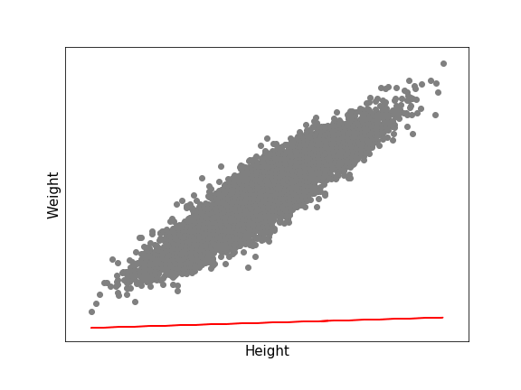
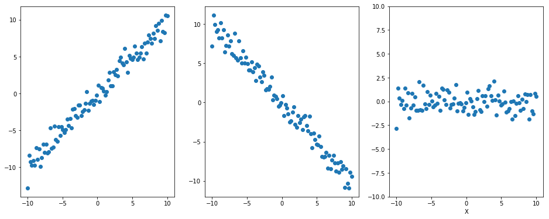
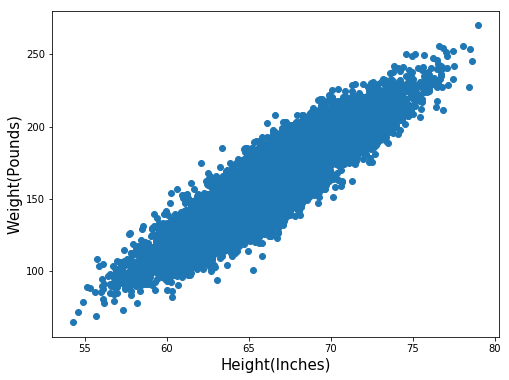
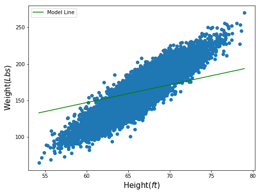
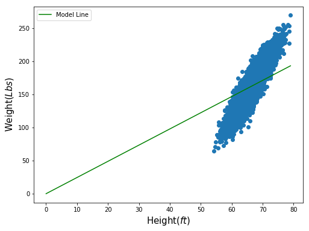
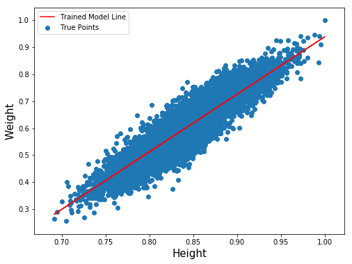
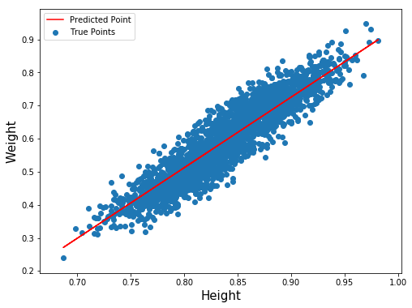
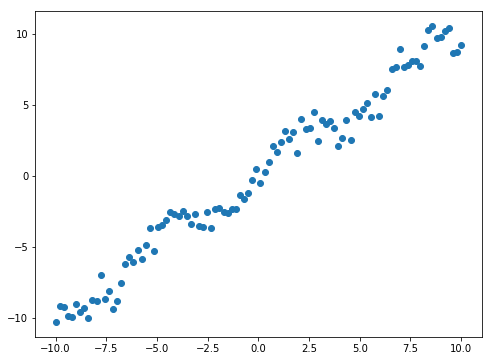
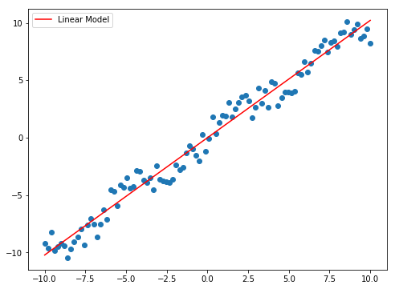
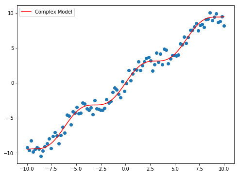

# Intro

In this post, we will go through what Linear Regression is and how to implement it from the scratch.



So what is Linear Regression? We use this when we want to find out an approximate linear relation between a feature and the remaining features of a dataset. This relation can be proportional or disproportional or none at all. 



With a linear regression model, we can predict (approximate) values. Examples where we can use this model are Height vs Weight, Income vs Age, Price of Houses vs Quality, and many more. In most cases, it is impossible to predict with no errors and the model tries to find a relation with the least errors. (This error is also called <u>residuals</u>)

There are several versions of linear regression such as ordinary least squares (OLS), generalized least squares (GLS), weighted least squares (WLS) and so on, with or without other forms of regularization but in this post, OLS will be covered.

# Code


```python
import numpy as np
import pandas as pd
import matplotlib.pyplot as plt
```

Before proceeding further, let's use weight vs height dataset from Kaggle for this exercise. You can find them [here](https://www.kaggle.com/mustafaali96/weight-height).

Once you download the data and put it in the same folder you are coding, let's load them and check the first five rows. 


```python
dat = pd.read_csv('./weight-height.csv')

dat.head()
```


<div>
<style scoped>
    .dataframe tbody tr th:only-of-type {
        vertical-align: middle;
    }

    .dataframe tbody tr th {
        vertical-align: top;
    }

    .dataframe thead th {
        text-align: right;
    }
</style>
<table border="1" class="dataframe">
  <thead>
    <tr style="text-align: right;">
      <th></th>
      <th>Gender</th>
      <th>Height</th>
      <th>Weight</th>
    </tr>
  </thead>
  <tbody>
    <tr>
      <th>0</th>
      <td>Male</td>
      <td>73.847017</td>
      <td>241.893563</td>
    </tr>
    <tr>
      <th>1</th>
      <td>Male</td>
      <td>68.781904</td>
      <td>162.310473</td>
    </tr>
    <tr>
      <th>2</th>
      <td>Male</td>
      <td>74.110105</td>
      <td>212.740856</td>
    </tr>
    <tr>
      <th>3</th>
      <td>Male</td>
      <td>71.730978</td>
      <td>220.042470</td>
    </tr>
    <tr>
      <th>4</th>
      <td>Male</td>
      <td>69.881796</td>
      <td>206.349801</td>
    </tr>
  </tbody>
</table>
</div>


```python
dat.shape
```


    (10000, 3)


There are 10000 samples and have $Gender, Height, Weight$ columns. Let's drop the Gender column so that we only have height and weight vectors. 

You can still use the $Gender$ column and using two separate models and compare the relation of weight and height by gender.


```python
dat = dat.drop('Gender', axis=1)
```

## Constructing a Model

There are two versions when constructing a linear regression model.
1. One whose line goes through the origin.
2. One whose line doesn't go through the origin (model with bias).

Let's start with a model that goes through the origin and compare it later to the one that doesn't.

If we choose the first model, we can build a model in two ways. One is using a closed-form equation and one is using a loop to find an appropriate weight $w$ (or slope) of the line with the least errors.

The equation for the closed form is as follows.
$$w = (X^TX)^{-1}X^Ty$$

Before we advance, let's first graph them out to visualize.



We can easily assume that the taller people get, the heavier the become.

With the equation above, we can get the $w$ by the following. (The @ means matrix multiplication)


```python
X = dat['Height']
y = dat['Weight']

closed_w = 1 / (X.T @ X) * X.T @ y

round(closed_w, 4)
```


    2.4502


Now let's plot the points with our simple model.



We see that the green line goes through the center of the data points, when there is obviously a better model with lower error values. This is due to the absence of the bias term. Let's look at the same graph as above but with wider x-axis.



Since the line has to go through the origin, the best solution it can generate is to go through the center of the data points. 

Now instead of using the closed-form equation, let's construct one using gradient descent. To do this, we need two helper functions and one main function.


```python
def grad_mse_weight(w, x, y, b):
    
    return -2 * np.mean((y - (w*x + b)) * x)

def grad_mse_bias(w, x, y, b):
    
    return -2 * np.mean(y - (w*x + b))

def predict(x, y, learning_rate=0.1):
    
    w = 0
    b = 0
    
    iter_num = 10000
    
    for i in range(iter_num):
        
        dw = grad_mse_weight(w, x, y, b)
        db = grad_mse_bias(w, x, y, b)
        
        b -= db * learning_rate
        w -= dw * learning_rate
        
    return w, b
```

The first two functions are used to determine the ideal slope of the linear regression (or the weight) and the bias term.

If you are not familiar with gradient descent, you can find them [here!](https://tlr.gitbook.io/data-science/machine-learning-basics/gradient-descent). To explain it briefly, these two functions compute a better value for bias and w at each iteration and update them. 

In <code>predict(x,y)</code> function, we are looping 10000 times and updating weight and bias every iteration. You can try putting different values for <code>learning_rate</code> and <code>iter_num</code> to acquire a better model.

When we train and test our model, it is a good practice to divide our data into two portions. One for training and one for testing the model. This is to avoid overfitting of the model. <strike>You can find a post about overfitting and underfitting of a model [here](). To be updated</strike>


```python
from sklearn.model_selection import train_test_split

X_train, X_val, y_train, y_val = train_test_split(X, y)
```

One more thing you should know is that our height and weight values are quite big that the loss function we are using (Mean Squared Errors) leads to exploding gradient descent values that the resulting bias and weight after predict function will likely generate NaN values. We can verify this with the following.


```python
w, b = predict(X_train, y_train)
w, b
```

    c:\users\hsong1101\anaconda3\envs\p\lib\site-packages\ipykernel_launcher.py:22: RuntimeWarning: invalid value encountered in double_scalars
    


    (nan, nan)


As you can see, the values for $w$ and $b$ are both nan values. This is because of too much update on both at each iteration. The following statement is the first five $w$ and $b$ values at each iteration (This could be different with different hyperparameters).

1. 0.3228807136656615 21.65726752224676
2. -2.2295643269137306 -148.1549601788397
3. 17.763141860690368 1183.3266020093588
4. -139.01850164601672 -9256.691211902544
5. 1090.2704303466826 72602.47884447992

This is one of reasons we normalize our data before setting up a model. By doing this, we are scaling all numeric values to range from 0 to 1 and doing this will prevent the model from generating any NaN values or exploding gradient descent as well as faster convergence.

There is another reason why we normalize. Our heights and weights have different scale that heights range from around 50 to 80 while weights range from 50 to 280. What if we changed the scale of heights from inches to feet or any other metric. Then we cannot use the same $w$ and $b$ as that model would work poorly due to different relation with different scale. 

If we both scale them to range from 0 to 1, then it doesn't matter if the heights value are in inches, feet or centimeters as the relation between two features will always have the same scale.

***

First let's normalize our data and find an appropriate values.


```python
x1 = X_train / X_train.max()
y1 = y_train / y_train.max()
```


```python
w, b = predict(x1, y1)

round(w, 4), round(b, 4)
```

Below is our data with trained model.



Now what we need to do is to predict and compare with true y values. Note that we have to scale them using the same <code>X_train.max</code> and <code>y_train.max</code> values for consistency or else the scale of the result will be different.


```python
x2 = X_val / X.max()
y2 = y_val / y.max()
```

Next is our testing set with prediction line.



Now that we have a model, let's see how much the error is. For the prediction, we should scale them back to its original form to compare with true y values. To do that, we can just multiply the y_max value to the predicted values.


```python
def MSE(pred, y):
    return np.mean(np.square(y - pred))
```


```python
print('Error Using Closed-Form Equation : {}'.format(MSE(X_val*w, y_val)))
print('Error Using Gradient Descent : {}'.format(MSE((x2*w+b) * y.max(), y_val)))
```

    Error Using Closed-Form Equation : 1019.9261523310762
    Error Using Gradient Descent : 153.93702071075964
    

***

We can use linear regression even on functions that are not linear as long as our weight vectors are linear. For example, consider the following plot.


```python
x = np.linspace(-10, 10, 100)
y = x + np.sin(x)
noise = np.random.normal(0, 0.7, 100)
true_y = y + noise
```



The data is generated with $f(x) = x + sin(x)$ with some noise. If we make a model with the function defined above, it will look like this.


```python
w, b = predict(x, y, learning_rate=0.01)
w, b
```


    (1.0211549273118783, 1.1088907569956085e-16)





```python
print('Error Value : {}'.format(MSE(w*x + b, true_y)))
```

    Error Value : 0.7936810997236736
    

Now let's define our model with the function $f(x) = \theta_1 x + sin(\theta_2 x)$. The next functions are gradient descent to compute $\theta_1$ and $\theta_2$. Since the above data goes through the origin, we don't have to include a bias term this time.


```python
def model(x, theta):
    return x*theta[0] + np.sin(x*theta[1])

def grad_dt1(x, y, theta):
    
    return -2 * np.mean(x * (y - theta[0] * x - np.sin(theta[1] * x)))

def grad_dt2(x, y, theta):
    
    return -2 * np.mean((y - (theta[0] * x + np.sin(theta[1] * x))) * (x * np.cos(theta[1] * x)))

def predict(x, y, theta, learning_rate=0.01):
    
    t1, t2 = 0, 0
    
    iter_num = 20
    
    for i in range(iter_num):
        
        dt1 = grad_dt1(x, y, theta)
        dt2 = grad_dt2(x, y, theta)
        
        t1 -= dt1 * learning_rate
        t2 -= dt2 * learning_rate
        
        
    return t1, t2
```


```python
t1, t2 = predict(x, y, [0, 0], learning_rate=0.0007)
t1, t2
```


    (0.9723320317973033, 0.9723320317973033)





```python
print('Error Value : {}'.format(MSE(model(x, [t1, t2]), y+noise)))
```

    Error Value : 0.5169340003737359
    

Note that I've tried many different learning_rate value to have one that fits well to the data points.

# End Note 

This post only deals with the basic linear regression without any regularization such as Lasso, Ridge or Elastic Net. There are many versions of it besides Ordinary Least Squares. These topics will be covered in later posts.

Thank you all for reading and if you find any errors or typos or have any suggestions, please let me know.

Thank you all for reading!
